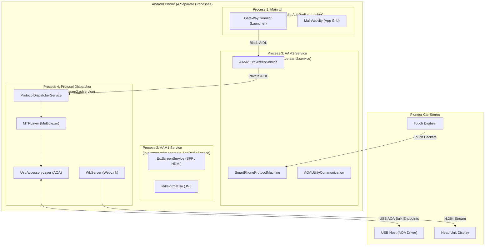
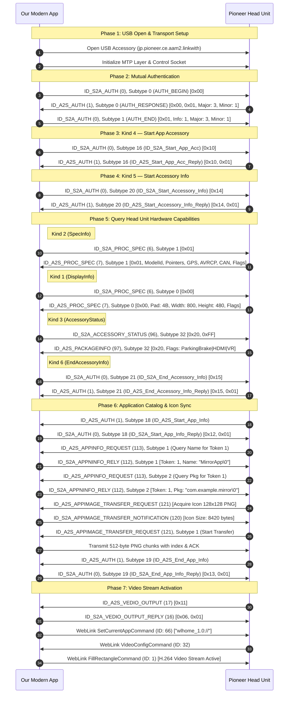

# Pioneer AppRadio Reverse Engineering — Complete Protocol & Architecture Agenda

> **Purpose**: This document is the definitive technical specification and single source of truth for reverse engineering the Pioneer AppRadio (AAM2 / WebLink) system. It details the exact byte-level wire protocols, endianness rules, handshake state machines, authentication payloads, app registration/icon transfer protocols, video streaming mechanisms, and touch input relay. It serves as the direct implementation blueprint for building our new modern Android virtual-display mirroring application and live log diagnostic tool.

---

## Table of Contents

1. [Project Overview & Architectural Vision](#1-project-overview--architectural-vision)
2. [Original App Identity & Decompiled Package Structure](#2-original-app-identity--decompiled-package-structure)
3. [Multi-Process System Architecture](#3-multi-process-system-architecture)
4. [Protocol Layering & Protocol Stack Architecture](#4-protocol-layering--protocol-stack-architecture)
5. [Critical Endianness & Byte-Order Reference](#5-critical-endianness--byte-order-reference)
6. [Transport Layer: MTP (Multiplexing Transport Protocol)](#6-transport-layer-mtp-multiplexing-transport-protocol)
7. [WebLink Wire Protocol Specification](#7-weblink-wire-protocol-specification)
8. [PProtocol Binary Framing Specification](#8-pprotocol-binary-framing-specification)
9. [SAC Protocol Command Reference (Opcodes & Subtypes)](#9-sac-protocol-command-reference-opcodes--subtypes)
10. [Exact Handshake Sequence & State Machine (RunableRetry)](#10-exact-handshake-sequence--state-machine-runableretry)
11. [Authentication & Certification Details](#11-authentication--certification-details)
12. [App Registration, App Info & Icon Transfer (Stereo Mirror Icon)](#12-app-registration-app-info--icon-transfer-stereo-mirror-icon)
13. [App Launch & Remote Navigation Commands](#13-app-launch--remote-navigation-commands)
14. [Video Output Handshake & Virtual Display Streaming Pipeline](#14-video-output-handshake--virtual-display-streaming-pipeline)
15. [Touch Digitizer & Hardware Key Input Relay](#15-touch-digitizer--hardware-key-input-relay)
16. [Audio Focus & AVRCP Remote Control Protocol](#16-audio-focus--avrcp-remote-control-protocol)
17. [Keepalive, Heartbeat & Session Synchronization](#17-keepalive-heartbeat--session-synchronization)
18. [Session Termination & Error Recovery Sequences](#18-session-termination--error-recovery-sequences)
19. [USB Accessory Setup & Intent Filtering](#19-usb-accessory-setup--intent-filtering)
20. [Head Unit Hardware Profiles & Model Identification](#20-head-unit-hardware-profiles--model-identification)
21. [Native Libraries Analysis (libPFormat.so & libWebLinkServerLib.so)](#21-native-libraries-analysis-libpformatso--libweblinkserverlibso)
22. [Modern Android Migration & Best Practice Replacements](#22-modern-android-migration--best-practice-replacements)
23. [New App Clean Architecture Design](#23-new-app-clean-architecture-design)
24. [Phase 1: Live Log Skeleton App Implementation Plan](#24-phase-1-live-log-skeleton-app-implementation-plan)
25. [Implementation Status & Completed Milestones](#25-implementation-status--completed-milestones)
26. [Head Unit Firmware (RootFS) Architecture & Binary Analysis](#26-head-unit-firmware-rootfs-architecture--binary-analysis)

---

## 1. Project Overview & Architectural Vision

We are creating a modern replacement Android application for Pioneer AppRadio Mode 2 (AAM2) compatible car stereo head units.

### Primary Goals:
1. **Ditch Legacy Proprietary Restrictions**: Replace the deprecated, permission-heavy Pioneer AppRadio Launcher with a lean, reliable Kotlin/Compose solution.
2. **Virtual Display Mirroring**: Instead of relying on insecure internal view-hierarchy scraping or physical HDMI cables, our app creates an Android `VirtualDisplay` via `MediaProjection` and streams hardware-encoded H.264 video directly over the AAM2 USB connection.
3. **True Two-Way Touch**: Translate touch digitizer coordinates received from the stereo touchscreen into native touch events dispatched to the virtual display.
4. **Phase 1 Diagnostic Tool (Live Log App)**: Build a rock-solid skeleton app first that connects to the stereo over USB Open Accessory (AOA), executes the complete authentication and initialization handshake, logs every raw and parsed packet in real-time, and allows instant log sharing/export for protocol debugging.

---

## 2. Original App Identity & Decompiled Package Structure

| Property | Value | Notes |
|---|---|---|
| **Package Name** | `jp.pioneer.mbg.appradio.AppRadioLauncher` | Target package name for whitelist spoofing if needed |
| **Version** | 2.8.11 (versionCode 31) | Latest stable release |
| **Compile / Target SDK** | Compile 28 (Pie), Target 29 (Q) | Requires modernisation for Android 14+ |
| **Min SDK** | 19 (KitKat 4.4) | Legacy Android support |
| **Application Class** | `AppRadiaoLauncherApp` (extends `AAM2ServerApp`) | Initializes WebLink server & AAM2 singletons |
| **Launcher Activity** | `GateWayConnect` | State machine entry point |
| **USB Accessory Filter** | Manufacturer: `Pioneer`, Model: `jp.pioneer.ce.aam2.linkwith`, Version: `1` | Specified in `accessory_filter.xml` |

---

## 3. Multi-Process System Architecture

The original AppRadio application runs across **4 separate processes**:



### In Our New App:
We unify this fragmented 4-process architecture into a **single, clean Android process** featuring a foreground service managing the USB transport, protocol framing, virtual display, and video encoding pipelines.

---

## 4. Protocol Layering & Protocol Stack Architecture

The AAM2 protocol stack is a layered multiplexing architecture. The physical connection is raw USB Accessory bulk streams, which are subdivided into logical channels:

```
┌─────────────────────────────────────────────────────────────────────────────┐
│                             Application Layer                               │
│           (Virtual Display Video Stream / Touch Event Dispatcher)           │
├──────────────────────────────────────┬──────────────────────────────────────┤
│          WebLink Protocol            │        Pioneer SAC Protocol          │
│   (Video Frames, Audio, Heartbeat)   │   (Auth, SpecInfo, AppList, Icons)   │
├──────────────────────────────────────┼──────────────────────────────────────┤
│          WebLink Commands            │           PProtocol Frame            │
│       ('WL' Header, Little-Endian)   │     (0x89..0x98 Header, Big-Endian)  │
├──────────────────────────────────────┴──────────────────────────────────────┤
│                   MTP (Multiplexing Transport Protocol)                     │
│                  (Framed Packets: 0x1E ... 0x03, Big-Endian)                │
├─────────────────────────────────────────────────────────────────────────────┤
│                      Abalta Userspace TCP/IP & Sockets                      │
│                  (Internal Port 51729 / Local Socket Loops)                 │
├─────────────────────────────────────────────────────────────────────────────┤
│                         USB Android Open Accessory                          │
│               (UsbAccessory FileDescriptor, 16KB Read Buffer)               │
└─────────────────────────────────────────────────────────────────────────────┘
```

---

## 5. Critical Endianness & Byte-Order Reference

> [!CAUTION]
> **Byte-order mismatches will instantly brick protocol communication.**
> The AAM2 system mixes **Big-Endian (Network Byte Order)** and **Little-Endian (Intel Byte Order)** across different protocol layers.

| Protocol Layer | Magic Bytes | Endianness | Number Primitives | Buffer Handler |
|---|---|---|---|---|
| **MTP Layer** | Begin: `0x1E` (30)<br/>End: `0x03` (3) | **Big-Endian** | Word (16-bit): MSB first<br/>DWord (32-bit): MSB first | `ByteUtils.ReadWord`, `ByteUtils.ReadDWord` |
| **WebLink Commands** | Magic: `0x57 0x4C` (`'W' 'L'`) | **Little-Endian** | Short (16-bit): LSB first<br/>Int (32-bit): LSB first<br/>Long (64-bit): LSB first<br/>Float: IEEE-754 Little-Endian | `DataBuffer.getShort`, `DataBuffer.getInt`, `DataBuffer.getLong`, `DataBuffer.getFloat` |
| **PProtocol Framing** | Header: `0x89 0x89`<br/>Tail: `0x98 0x98` | **Big-Endian** | Int (32-bit): MSB first (Standard Java `DataOutputStream`) | `DataInputStream.readInt()`, `DataOutputStream.writeInt()` |
| **SAC Command Payloads** | Opcode-dependent | **Big-Endian** | Short: MSB first<br/>Int: MSB first<br/>Long: MSB first | `DataInputStream.readShort()`, `DataOutputStream.writeShort()` |

### Verification from Codebase:
1. **WebLink (`DataBuffer.java`)**:
   ```java
   public int getInt(int i) {
       int i2 = i + this.m_startPos;
       return ((this.m_data[i2+3] & 255) << 24) |
              ((this.m_data[i2]   & 255) << 0)  |
              ((this.m_data[i2+1] & 255) << 8)  |
              ((this.m_data[i2+2] & 255) << 16); // Little-Endian!
   }
   ```
2. **MTP Layer (`ByteUtils.java`)**:
   ```java
   public static int getWord(byte[] bArr, int i) {
       return getUnsignedSafe(bArr, i + 1) + ((getUnsignedSafe(bArr, i) << 8) & 65280); // Big-Endian!
   }
   ```
3. **PProtocol (`PProtocol.java`)**:
   ```java
   // Uses standard java.io.DataOutputStream which writes integers in Big-Endian format
   dataOutputStream.write(s_header); // 0x89, 0x89
   dataOutputStream.writeInt(length); // Big-Endian 4-byte int
   ```

---

## 6. Transport Layer: MTP (Multiplexing Transport Protocol)

The MTP layer (`com.abaltatech.mcs.mtp`) multiplexes multiple logical data streams (TCP sockets, UDP datagrams, control channels) across a single stream transport (USB bulk or Bluetooth RFCOMM).

### 6.1 MTP Packet Layout

```
Offset   Size     Field              Description
─────────────────────────────────────────────────────────────────────────────
0        1        MTP_BEGIN_FRAME    Fixed value: 0x1E (decimal 30, ASCII RS)
1        2        Frame Size         Total packet size in bytes (Big-Endian uint16)
3        2        Frame Options      Bit-packed options word (Big-Endian uint16)
5        1..19    Source Address     Variable-length address structure
5+N      1..19    Dest Address       Variable-length address structure
5+N+M    K        Payload Data       Raw channel payload bytes
End-3    2        Checksum (Opt)     Present only if checksum bit set (Big-Endian uint16)
End-1    1        MTP_END_FRAME      Fixed value: 0x03 (decimal 3, ASCII ETX)
```

### 6.2 Frame Options Bit-Field Layout (16-bit word)

```
Bit:  [15 .. 10]    [9]           [8]           [7 .. 4]       [3 .. 1]       [0]
      Reserved   IsCompressed   HasChecksum   MessageType   SourceProtocol  IsLastMsg
```
- **Bit 0 (`IsLastMsg`)**: `1` if this is the last fragment of the message, `0` otherwise.
- **Bits 1..3 (`SourceProtocol`)**:
  - `0` = TCP stream (`MTP_PROTOCOL_TCP`)
  - `1` = UDP datagram (`MTP_PROTOCOL_UDP`)
- **Bits 4..7 (`MessageType`)**:
  - `0` = `PT_Data`: Regular data packet
  - `1` = `PT_ResolveAddr`: Address resolution request/response
  - `2` = `PT_OpenListenConn`: Open server socket listener
  - `3` = `PT_CloseListenConn`: Close server socket listener
  - `4` = `PT_StartDGramListen`: Start UDP listener
  - `5` = `PT_StopDGramListen`: Stop UDP listener
- **Bit 8 (`HasChecksum`)**: `1` if 2-byte checksum is appended before `0x03`.
- **Bit 9 (`IsCompressed`)**: `1` if payload is compressed.

### 6.3 Address Encoding
- `0x00`: Null / None address (Size: 1 byte)
- `0x01`: IPv4 address (Size: 7 bytes: `1 byte schema + 4 bytes IP + 2 bytes port (Big-Endian)`)
- `0x02`: IPv6 address (Size: 19 bytes: `1 byte schema + 16 bytes IP + 2 bytes port (Big-Endian)`)

### 6.4 Well-Known MTP Port Assignments
- **Port 12347 (`WL_CLIENTPORT_CONTROL_CHANNEL`)**: Dedicated TCP stream for all SAC commands, PFormat framed packets, hardware capabilities inquiry, and session handshake.
- **Port 12346 (`WL_CLIENTPORT_VIDEO_CHANNEL`)**: Dedicated TCP stream for WebLink H.264 video frame transmission to the stereo display.
- **Port 44477 (`SERVER_CONTROL_PORT`)**: Internal Abalta server control.

### 6.5 PFormat over MTP Wire Encapsulation (Empirical Hardware Finding)
> [!IMPORTANT]
> **Real Hardware Handshake Finding**:
> Pioneer head units running AppRadio Mode 2 (AAM2) over USB AOA do **not** accept bare PFormat frames (`0x9F ... 0x9F 0x03`) directly on the raw USB socket. All PFormat packets must be encapsulated within an MTP TCP Data Packet targeting Port `12347`.
>
> 1. Upon USB attachment, the car stereo initiates an MTP connection by sending a probe/SYN packet to port 12347.
> 2. The phone acknowledges with an empty-payload MTP packet (`MTPCodec.createConnectionAck()`).
> 3. The phone waits 1000ms (`postDelayed(..., 1000L)`) and initiates `AuthBegin` (`SACCommand.AuthBegin`) encapsulated in an MTP packet.
> 4. If no response is received, the phone executes a 3-second retry loop (up to 3 attempts, matching Pioneer's `AccessoryAuthor.java`).

---

## 7. WebLink Wire Protocol Specification

Used for display streaming, input events, and time synchronization.

### 7.1 WebLink Command Header (8 bytes)

```
Offset   Size   Field          Description
─────────────────────────────────────────────────────────────────────────────
0        1      Magic Byte 1   0x57 (ASCII 'W')
1        1      Magic Byte 2   0x4C (ASCII 'L')
2        2      Command ID     uint16 (Little-Endian)
4        4      Payload Size   uint32 (Little-Endian) — length of payload only
8        N      Payload        Variable-length command-specific payload
```

### 7.2 Complete WebLink Command Table

| Command ID | Hex | Name | Direction | Criticality | Description |
|---|---|---|---|---|---|
| **1** | 0x0001 | `FILL_RECTANGLE` | Phone → Stereo | **CRITICAL** | Video frame (H.264 NAL units) |
| **16** | 0x0010 | `MOUSE_COMMAND` | Stereo → Phone | Legacy | Mouse position/click |
| **17** | 0x0011 | `KEYBOARD_COMMAND` | Stereo → Phone | Normal | Hardware keyboard key event |
| **18** | 0x0012 | `BROWSER_COMMAND` | Stereo → Phone | Important | Navigation (Action 0 = Back key) |
| **19** | 0x0013 | `SHOW_KEYBOARD` | Phone → Stereo | Normal | Show virtual keyboard on stereo |
| **20** | 0x0014 | `HIDE_KEYBOARD` | Phone → Stereo | Normal | Hide virtual keyboard |
| **21** | 0x0015 | `WAIT_INDICATOR` | Phone → Stereo | Normal | Display busy spinner |
| **32** | 0x0020 | `VIDEO_CONFIG` | Stereo → Phone | **CRITICAL** | Stereo sends supported resolutions/codecs |
| **48** | 0x0030 | `RECONNECT` | Both | Recovery | Re-establish video/input session |
| **64** | 0x0040 | `SETUP_SCROLL` | Phone → Stereo | Optional | Set scroll boundaries |
| **65** | 0x0041 | `SCROLL_UPDATE` | Stereo → Phone | Optional | Scroll gesture updates |
| **66** | 0x0042 | `SET_CURRENT_APP` | Phone → Stereo | **CRITICAL** | Active app URI (e.g. `wlhome_1.0://`) |
| **67** | 0x0043 | `START_AUDIO` | Phone → Stereo | Audio | Initialize audio channel |
| **68** | 0x0044 | `STOP_AUDIO` | Phone → Stereo | Audio | Teardown audio channel |
| **69** | 0x0045 | `AUDIO_DATA` | Phone → Stereo | Audio | Raw audio PCM samples |
| **70** | 0x0046 | `PAUSE_AUDIO` | Phone → Stereo | Audio | Pause audio channel |
| **71** | 0x0047 | `SET_FPS` | Stereo → Phone | **CRITICAL** | Requested frame rate (1..30 fps) |
| **72** | 0x0048 | `TOUCH_COMMAND` | Stereo → Phone | **CRITICAL** | Multi-touch digitizer coordinates |
| **73** | 0x0049 | `SYNC_SESSION_TIME`| Both | **CRITICAL** | Heartbeat / ping-pong time sync |
| **74** | 0x004A | `FRAME_DIAGNOSTIC` | Phone → Stereo | Debug | Frame transmission statistics |

---

## 8. PProtocol Binary Framing Specification

PProtocol (`jp.pioneer.mbg.appradio.AAM2Service.protocol.PProtocol`) packages all Pioneer-specific control messages (authentication, product specs, touch relay, app catalog, icon transfers).

### 8.1 PProtocol Frame Structure (Exact 1024-byte packet)

```
Offset   Size   Field            Value / Description
─────────────────────────────────────────────────────────────────────────────
0        2      Magic Header     0x89 0x89 (signed bytes: [-119, -119])
2        4      Package Size     Big-Endian int32: (22 + payload.length + 2)
6        4      Sequence Count   Big-Endian int32: auto-incrementing packet counter
10       4      SDK Version      Big-Endian int32: Build.VERSION.SDK_INT
14       4      Payload Type     Big-Endian int32:
                                   0 = SAC Command Payload
                                   1 = Serialized MotionEvent
                                   2 = Serialized KeyEvent
18       N      SAC Data         Payload bytes (SAC command structure)
18+N     2      Magic Tail       0x98 0x98 (signed bytes: [-104, -104])
20+N     4      CRC Checksum     Big-Endian int32: arithmetic sum of bytes 0..(20+N-1)
24+N     ...    Zero Padding     Padded with zeroes up to exactly 1024 bytes
```

### 8.2 CRC Checksum Algorithm
```java
int calculateCRC(byte[] buffer, int length) {
    int sum = 0;
    for (int i = 0; i < length; i++) {
        sum += buffer[i]; // Standard signed 8-bit byte addition
    }
    return sum;
}
```

---

## 9. SAC Protocol Command Reference (Opcodes & Subtypes)

The SAC (Smart-phone to Accessory Communication) protocol operates inside PProtocol frames where `Payload Type == 0`.

### 9.1 S2A Commands (Smartphone → Head Unit)

| Opcode | Hex | Constant | Subtype | Subtype Name | Payload Fields |
|---|---|---|---|---|---|
| **0** | 0x00 | `ID_S2A_AUTH` | 0 | `AUTH_BEGIN` | None (1 byte: `0x00`) |
| | | | 1 | `AUTH_END` | `[info: byte, majorVer: short, minorVer: short]` |
| | | | 16 | `ID_S2A_Start_App_Acc` | None (1 byte: `0x10`) |
| | | | 17 | `ID_S2A_End_App_Acc` | None (1 byte: `0x11`) |
| | | | 18 | `ID_S2A_Start_App_Info_Reply` | `[status: byte]` (1 = OK) |
| | | | 19 | `ID_S2A_End_App_Info_Reply` | `[status: byte]` (1 = OK) |
| | | | 20 | `ID_S2A_Start_Accessory_Info` | None (1 byte: `0x14`) |
| | | | 21 | `ID_S2A_End_Accessory_Info` | None (1 byte: `0x15`) |
| **2** | 0x02 | `ID_S2A_TERMINATION` | 0 | `TERMINATE` | `[type: byte]` |
| **6** | 0x06 | `ID_S2A_PROC_SPEC` | 0 | `REQUEST_DISPLAY_INFO` | `[type: byte (0x00)]` |
| | | | 1 | `REQUEST_SPEC_INFO` | `[type: byte (0x01)]` |
| **16** | 0x10 | `ID_S2A_VEDIO_OUTPUT_REPLY`| 6 | `D0_VEDIO_OUTPUT` | `[type: byte (0x06), status: byte (0x01)]` |
| **66** | 0x42 | `ID_S2A_KEY` | 0..3 | `KEY_EVENT` | `[type: byte, keycode: byte]` |
| **80** | 0x50 | `ID_S2A_SMARTPHONE_AUDIOFOCUS_REPLAY` | 1 | `AUDIO_FOCUS_REPLY` | `[type: byte (0x01), result: byte (1=OK, 0=NG)]` |
| **82** | 0x52 | `ID_S2A_SCREEN` | 0 | `BACK_HOME` | `[type: byte (0x00), keycode: byte]` |
| | | | 255 | `ERROR_REPLY` | `[type: byte (0xFF), cmd: byte, param: byte]` |
| **96** | 0x60 | `ID_S2A_ACCESSORY_STATUS` | 32 | `REQUEST_STATUS` | `[type: byte (0x20), 0xFF]` |
| **112**| 0x70 | `ID_S2A_APPNINFO_RELY`| 1 | `APP_NAME_REPLY` | `[type: byte (0x01), appToken: short, len: short, utf8_name]` |
| | | | 2 | `PACKAGE_NAME_REPLY` | `[type: byte (0x02), appToken: short, len: short, utf8_pkg]` |
| **114**| 0x72 | `ID_S2A_TRACKNFO_RELY`| 1..6 | `TRACK_INFO_DATA` | Formatted track metadata |
| **120**| 0x78 | `ID_S2A_APPIMAGE_TRANSFER_NOTIFICATION` | 0 | `ACQUISITION_REPLY` | `[type: 0x00, appToken: short, result: byte, totalSize: int32]` |
| | | | 2 | `TRANSFER_CHUNK` | `[type: 0x02, appToken: short, index: short, len: short, chunk: 512B]` |
| | | | 3 | `TRANSFER_END` | `[type: 0x03, appToken: short, endType: byte (0=OK, 1=Fail)]` |
| | | | 4 | `TRANSFER_CANCEL_REPLY` | `[type: 0x04, appToken: short]` |

### 9.2 A2S Commands (Head Unit → Smartphone)

| Opcode | Hex | Constant | Subtype | Subtype Name | Description |
|---|---|---|---|---|---|
| **1** | 0x01 | `ID_A2S_AUTH` | 0 | `AUTH_RESPONSE` | `[0x00, result: byte, majorVer: short, minorVer: short]` |
| | | | 16 | `ID_A2S_Start_App_Acc_Reply` | `[0x10, result: byte (0x01)]` |
| | | | 17 | `ID_A2S_End_App_Acc_Reply` | `[0x11, result: byte (0x01)]` |
| | | | 18 | `ID_A2S_Start_App_Info` | Stereo begins app list discovery |
| | | | 19 | `ID_A2S_End_App_Info` | Stereo finishes app list discovery |
| | | | 20 | `ID_A2S_Start_Accessory_Info_Reply` | `[0x14, result: byte (0x01)]` |
| | | | 21 | `ID_A2S_End_Accessory_Info_Reply` | `[0x15, result: byte (0x01)]` |
| **3** | 0x03 | `ID_A2S_TERMINATION` | 0 | `TERMINATE` | Head unit requests disconnect |
| **7** | 0x07 | `ID_A2S_PROC_SPEC` | 0 | `DISPLAY_INFO` | `[0x00, pad: 4B, width: short, height: short, flags: int32]` |
| | | | 1 | `SPEC_INFO` | `[0x01, devId: short, pointers: byte, gps: byte, avrcp: byte, can: byte, flags: byte]` |
| **17** | 0x11 | `ID_A2S_VEDIO_OUTPUT`| 0 | `VIDEO_START` | Stereo requests phone to begin video stream |
| **49** | 0x31 | `ID_A2S_LOCATIONMAILDATA` | - | `GPS_MAIL_DATA` | 84-byte NMEA / GPS blob from stereo |
| **53** | 0x35 | `ID_A2S_GEOLOCATIONDATA` | 1 | `GPS_COORDINATES` | Latitude, Longitude, Altitude, Speed, Heading |
| **65** | 0x41 | `ID_A2S_KEY` | 0 | `ACTION_KEY` | Home, Menu, Back key press |
| | | | 2 | `INPUT_KEY` | Direct input key events |
| **67** | 0x43 | `ID_A2S_TOUCH` | - | `TOUCH_EVENT` | Pioneer binary touch digitizer event |
| **81** | 0x51 | `ID_A2S_REMOTECTRL` | 0 | `AV_CONTROL` | AVRCP Play, Pause, Track Up/Down, FF, RW |
| | | | 1 | `AUDIO_FOCUS_REQ` | Stereo requests phone audio focus |
| **83** | 0x53 | `ID_A2S_APPS` | 0 | `LAUNCH_HOME` | User pressed Home on stereo |
| | | | 1 | `LAUNCH_PACKAGE` | User tapped app (by package name) |
| | | | 2 | `LAUNCH_TOKEN` | User tapped app (by appToken) |
| **97** | 0x61 | `ID_A2S_PACKAGEINFO` | 32 | `ACCESSORY_STATUS` | Parking brake status, HDMI state, VR state |
| **113**| 0x71 | `ID_A2S_APPINFO_REQUEST`| 1 | `QUERY_APP_NAME` | Stereo asks for App Name of `appToken` |
| | | | 2 | `QUERY_PACKAGE_NAME` | Stereo asks for Package Name of `appToken` |
| **121**| 0x79 | `ID_A2S_APPIMAGE_TRANSFER_REQUEST` | 0 | `ACQUISITION_REQ` | Stereo queries icon dimensions & format |
| | | | 1 | `START_TRANSFER` | Stereo ready to receive icon chunks |
| | | | 2 | `CHUNK_ACK` | Stereo acknowledges chunk index |
| | | | 3 | `TRANSFER_COMPLETE`| Stereo confirms full icon received |
| | | | 4 | `CANCEL_TRANSFER` | Stereo cancels icon download |

---

## 10. Exact Handshake Sequence & State Machine (RunableRetry)

The entire initialization handshake is driven by a deterministic state machine managed by `RunableRetry.java`.

### 10.1 Complete State Machine Transitions



### 10.2 Handshake Timer & Retry Specifications

From `RunableRetry.java`:

| Kind ID | State Name | Command Sent | Max Retries | Interval (ms) | Trigger to Next State |
|---|---|---|---|---|---|
| **4** | `INIT_START_APP_ACC` | `ID_S2A_Start_App_Acc` | **2** | **500 ms** | Receives `ID_A2S_Start_App_Acc_Reply` → triggers Kind 5 |
| **5** | `INIT_START_ACCESSORY` | `ID_S2A_Start_Accessory_Info` | **3** | **3000 ms** | Receives `ID_A2S_Start_Accessory_Info_Reply` → queues 2, 1, 3, 6 |
| **2** | `REQUEST_SPECINFO` | `ID_S2A_PROC_SPEC` (type 1) | **3** | **3000 ms** | Receives `ID_A2S_PROC_SPEC` (type 1) → triggers Kind 1 |
| **1** | `REQUEST_DISPLAY` | `ID_S2A_PROC_SPEC` (type 0) | **3** | **3000 ms** | Receives `ID_A2S_PROC_SPEC` (type 0) → triggers Kind 3 |
| **3** | `REQUEST_STATUS` | `ID_S2A_ACCESSORY_STATUS` | **3** | **3000 ms** | Receives `ID_A2S_PACKAGEINFO` → triggers Kind 6 |
| **6** | `INIT_END_ACCESSORY` | `ID_S2A_End_Accessory_Info` | **3** | **3000 ms** | Receives `ID_A2S_End_Accessory_Info_Reply` → Phase 5 complete |
| **8** | `APP_IMAGE_START` | `sendAppImageDataAcquisitionStartReply` | **1** | **5000 ms** | Receives `ID_A2S_APPIMAGE_TRANSFER_REQUEST` (sub 1) → triggers 9 |
| **9** | `APP_IMAGE_CHUNK` | `sendAppImageDataTransfer` (512B) | **3** | **3000 ms** | Receives `ID_A2S_APPIMAGE_TRANSFER_REQUEST` (sub 2) ack → next chunk |
| **10**| `APP_IMAGE_END` | `sendAppImageDataTransferEnd` | **3** | **3000 ms** | Receives `ID_A2S_APPIMAGE_TRANSFER_REQUEST` (sub 3) |

---

## 11. Authentication & Certification Details

### 11.1 The Pioneer Salt & Certification Hash
Pioneer validates certified 3rd party apps using a double-MD5 hash salt:
```kotlin
fun generateAppCertificationHash(packageName: String): String {
    val salt = "PionnerKit" // Exact spelling required (notice 'nn')
    val inner = md5(packageName + salt)
    return md5(inner).lowercase()
}
```

### 11.2 Known Hash Signatures
- Pioneer AppRadio:
  - Package: `jp.pioneer.mbg.appradio.AppRadioLauncher`
  - Hash: `cc8116896fab216025f7dda114f9107f`
- Pioneer DOP (Dual-Operator Platform):
  - Package: `jp.pioneer.mbgdop.appradio.AppRadioLauncher`
  - Hash: `01fc011abd9e9b24176ff811cebac72c`

---

## 12. App Registration, App Info & Icon Transfer (Stereo Mirror Icon)

The Pioneer head unit features its own on-screen application launcher grid. It discovers apps running on the phone, requests their names, and downloads their icons to display on the head unit dashboard.

### 12.1 AppToken System
- The phone assigns an integer `appToken` (values `1 .. 1024`) to every registered application.
- The phone maintains a table: `appToken ↔ packageName`.

### 12.2 App Name & Package Name Queries
When the stereo wants details for an `appToken`, it sends:
- `ID_A2S_APPINFO_REQUEST` (113), Subtype 1 (Name):
  - Phone replies with `ID_S2A_APPNINFO_RELY` (112), Subtype 1:
    - `[type: 0x01, appToken: short, strLen: short, utf8_name_bytes + 0x00]`
- `ID_A2S_APPINFO_REQUEST` (113), Subtype 2 (Package Name):
  - Phone replies with `ID_S2A_APPNINFO_RELY` (112), Subtype 2:
    - `[type: 0x02, appToken: short, strLen: short, utf8_pkg_bytes + 0x00]`

### 12.3 Stereo Mirror Icon Transfer Protocol (Exact Flow)

```
Head Unit (Stereo)                                        Phone (App)
──────────────────                                        ───────────
   │                                                           │
   │ 1. ID_A2S_APPIMAGE_TRANSFER_REQUEST (121)                 │
   │    [Subtype: 0x00 (Acquisition),                          │
   │     appToken: short, imageKind: 0x10 (APPICON),           │
   │     imageType: 0x12 (PNG=18), width: short, height: short]│
   │──────────────────────────────────────────────────────────>│
   │                                                           │ (App resizes icon &
   │                                                           │  compresses to PNG)
   │ 2. ID_S2A_APPIMAGE_TRANSFER_NOTIFICATION (120)            │
   │    [Subtype: 0x00, appToken: short,                       │
   │     result: 0x00 (OK), totalBytes: int32]                 │
   │<──────────────────────────────────────────────────────────│
   │                                                           │
   │ 3. ID_A2S_APPIMAGE_TRANSFER_REQUEST (121)                 │
   │    [Subtype: 0x01 (Start Data Transfer), appToken: short] │
   │──────────────────────────────────────────────────────────>│
   │                                                           │
   │ 4. ID_S2A_APPIMAGE_TRANSFER_NOTIFICATION (120)            │
   │    [Subtype: 0x02 (Chunk Data), appToken: short,          │
   │     chunkIndex: 0x0000, chunkLen: 512, payload: 512 bytes]│
   │<──────────────────────────────────────────────────────────│
   │                                                           │
   │ 5. ID_A2S_APPIMAGE_TRANSFER_REQUEST (121)                 │
   │    [Subtype: 0x02 (Chunk ACK),                            │
   │     appToken: short, ackChunkIndex: 0x0000]               │
   │──────────────────────────────────────────────────────────>│
   │                                                           │
   │ 6. (Repeat steps 4 & 5 until all chunks transferred)      │
   │    ...                                                    │
   │                                                           │
   │ 7. ID_S2A_APPIMAGE_TRANSFER_NOTIFICATION (120)            │
   │    [Subtype: 0x03 (Transfer Complete),                    │
   │     appToken: short, endType: 0x00 (Success)]             │
   │<──────────────────────────────────────────────────────────│
   │                                                           │
   │ 8. ID_A2S_APPIMAGE_TRANSFER_REQUEST (121)                 │
   │    [Subtype: 0x03 (End Confirmed), appToken: short]       │
   │──────────────────────────────────────────────────────────>│
```

### 12.4 Image Transfer Parameters
- **Chunk Size**: Exactly **512 bytes** per packet.
- **Image Format**: Always **PNG** (`APP_IMAGE_TYPE_PNG = 18`). The stereo checks format 18.
- **Image Kind**: Always **App Icon** (`APP_IMAGE_KIND_APPICON = 16`).
- **Maximum Resolution**: 4096 × 4096 (typical requested sizes are 128×128 or 256×256).

---

## 13. App Launch & Remote Navigation Commands

When a user interacts with the head unit UI:

### 13.1 App Launch Commands (`ID_A2S_APPS = 83`)
1. **Launch Home (`Subtype 0`)**:
   - User touched the physical or virtual "Home" / "Apps" button on the Pioneer unit.
   - Payload: `[0x00, 0x00]`.
   - Action: Phone brings the Launcher / Main mirroring UI to the foreground.
2. **Launch by Package Name (`Subtype 1`)**:
   - Payload: `[0x01, utf8_package_name_bytes]`.
   - Action: Phone checks if package exists and starts its main activity.
3. **Launch by AppToken (`Subtype 2`)**:
   - Payload: `[0x02, appToken: short]`.
   - Action: Phone resolves `appToken` to package name and launches it.

### 13.2 Browser Back Command (`WebLink Command ID: 18`)
- When the user presses the Back button on the head unit screen:
  - Stereo sends WebLink `BrowserCommand` (ID: 18) with `action = 0`.
  - Action: Phone simulates `KeyEvent.KEYCODE_BACK` (keycode 4) on the active display.

---

## 14. Video Output Handshake & Virtual Display Streaming Pipeline

### 14.1 Video Output Activation Flow
1. Stereo sends SAC opcode 17: `ID_A2S_VEDIO_OUTPUT` (`[0x11]`).
2. Phone marks `HDMIState = true` and `AdvancedMode = true`.
3. Phone replies with SAC opcode 16: `ID_S2A_VEDIO_OUTPUT_REPLY` (`[0x06, 0x01]`).
4. WebLink session initializes:
   - Phone sends `SetCurrentAppCommand` (ID: 66, payload: `"wlhome_1.0://"`).
   - Stereo sends `VideoConfigCommand` (ID: 32) specifying destination resolution (e.g., 800×480).
   - Stereo sends `SET_FPS` (ID: 71, e.g., 30 FPS).
   - Phone configures `MediaCodec` H.264 encoder.
   - Phone creates `VirtualDisplay` matching stereo dimensions.
   - Every encoded frame is wrapped in `FillRectangleCommand` (ID: 1) and sent over USB.

### 14.2 FillRectangleCommand (ID: 1) Frame Structure

```
WebLink Header (8 bytes):
  0x57 0x4C, Command ID: 0x0001 (LE), Payload Size: 16 + NAL_Size (LE)

Payload Internal Header (16 bytes, Little-Endian):
  Bytes 0..3:   Width (int32, e.g. 800)
  Bytes 4..7:   Height (int32, e.g. 480)
  Bytes 8..11:  Encoding Type (int32 = 2 for FRAME_ENCODING_H264)
  Bytes 12..15: App ID (int32 = 0)

Payload Video Data:
  Bytes 16+:    Raw H.264 NAL Units (SPS, PPS, IDR, P-Frames)
```

---

## 15. Touch Digitizer & Hardware Key Input Relay

### 15.1 WebLink TouchCommand (ID: 72) Structure

```
Payload Offset   Size   Field        Description
─────────────────────────────────────────────────────────────────────────────
0                4      EventType    Little-Endian int32: 0=Begin, 1=Update, 2=End
4                4      PointCount   Little-Endian int32: Number of touch points (e.g. 1)

For each touch point (20 bytes each):
+0               4      PointerID    Little-Endian int32 (0, 1, 2...)
+4               4      X            Little-Endian int32 (Stereo X coordinate)
+8               4      Y            Little-Endian int32 (Stereo Y coordinate)
+12              4      State        Little-Endian int32:
                                       1 = Pressed (Down)
                                       2 = Moved
                                       4 = Stationary
                                       8 = Released (Up)
+16              4      Pressure     Little-Endian float (0.0 .. 1.0)
```

### 15.2 Dispatching Touch to Android Virtual Display
In our new architecture, we map the coordinates `(X, Y)` from stereo display dimensions to virtual display space:
```kotlin
val scaledX = (rawX.toFloat() / stereoWidth) * virtualDisplayWidth
val scaledY = (rawY.toFloat() / stereoHeight) * virtualDisplayHeight

val motionEvent = MotionEvent.obtain(
    downTime,
    eventTime,
    when (state) {
        1 -> MotionEvent.ACTION_DOWN
        2 -> MotionEvent.ACTION_MOVE
        8 -> MotionEvent.ACTION_UP
        else -> MotionEvent.ACTION_MOVE
    },
    scaledX,
    scaledY,
    pressure,
    1.0f, 0, 1.0f, 1.0f, deviceId, 0
)
// Dispatched directly to the presentation window or via InputManager
```

---

## 16. Audio Focus & AVRCP Remote Control Protocol

### 16.1 Audio Focus Handshake
1. When the stereo switches audio sources, it sends SAC opcode 81 (`ID_A2S_REMOTECTRL`), subtype 1 (`ID_A2S_AUDIOFOCUS_REQUEST`).
2. Phone evaluates Android `AudioManager` focus:
   - Request focus: `AudioManager.requestAudioFocus(AUDIOFOCUS_GAIN)`.
3. Phone replies with SAC opcode 80 (`ID_S2A_SMARTPHONE_AUDIOFOCUS_REPLAY`):
   - `[type: 0x01, result: 0x01 (OK) or 0x00 (NG)]`.

### 16.2 AVRCP Commands (`ID_A2S_REMOTECTRL = 81, Subtype 0`)
The stereo hardware steering-wheel and panel buttons send commands:
- `0` = Toggle Play/Pause
- `1` = Play
- `2` = Pause
- `3` = Next Track (`TRACKUP`)
- `4` = Previous Track (`TRACKDOWN`)
- `5` = Fast Forward (`FF`)
- `6` = Rewind (`RW`)

---

## 17. Keepalive, Heartbeat & Session Synchronization

### 17.1 WebLink Session Time Sync (`SYNC_SESSION_TIME = 73`)
- **Sender**: Stereo head unit sends periodically (typically every 1–2 seconds).
- **Format**: Two 64-bit Little-Endian longs: `[ClientTime: 8 bytes, ServerTime: 8 bytes]`.
- **Response Rule**: The phone **must immediately echo** the packet back, retaining the original `ClientTime` and inserting current phone uptime as `ServerTime`:
  ```kotlin
  fun handleSyncSessionTime(cmd: SyncSessionTimeCommand) {
      connection.sendCommand(SyncSessionTimeCommand(
          cmd.clientTime,
          SystemClock.uptimeMillis()
      ))
  }
  ```

### 17.2 Data Loss Detection & Timeouts
- If no packet is received for **15,000 ms (15 seconds)**, the connection is considered dead, triggering an orderly teardown and reset to `STATE_ACCEPT`.

---

## 18. Session Termination & Error Recovery Sequences

### 18.1 Clean Termination
- Phone sends SAC opcode 2 (`ID_S2A_TERMINATION`), payload `[0x00]`.
- Stereo sends SAC opcode 3 (`ID_A2S_TERMINATION`).
- Transport closed cleanly.

### 18.2 Error Recovery in RunableRetry
- If any handshake stage (Kind 1..7) exceeds its max retry count without receiving an acknowledgment:
  1. `RunableRetry` logs `disconnectSPP`.
  2. USB accessory stream is closed.
  3. `AOAUtilityCommunication` returns to `STATE_ACCEPT (65281)`.
  4. System waits for accessory re-attachment or resets USB bulk endpoints.

---

## 19. USB Accessory Setup & Intent Filtering

### 19.1 Target Accessory Filter (`accessory_filter.xml`)
```xml
<?xml version="1.0" encoding="utf-8"?>
<resources>
    <usb-accessory
        manufacturer="Pioneer"
        model="jp.pioneer.ce.aam2.linkwith"
        version="1" />
</resources>
```

### 19.2 AndroidManifest.xml Integration
```xml
<activity
    android:name=".usb.UsbAccessoryActivity"
    android:exported="true"
    android:taskAffinity=""
    android:excludeFromRecents="true"
    android:noHistory="true">
    <intent-filter>
        <action android:name="android.hardware.usb.action.USB_ACCESSORY_ATTACHED" />
    </intent-filter>
    <meta-data
        android:name="android.hardware.usb.action.USB_ACCESSORY_ATTACHED"
        android:resource="@xml/accessory_filter" />
</activity>
```

---

## 20. Head Unit Hardware Profiles & Model Identification

Reported via `ID_A2S_PROC_SPEC (Opcode 7, Subtype 1)`:

| Model ID (Hex) | Region / Type | Description | Display Spec |
|---|---|---|---|
| `0x2002` (8194) | Default Overseas | AppRadio 2/3/4 & SPH-DA series | 800 × 480, 2-point touch |
| `0x2301` (8961) | Japan Domestic | Carrozzeria CyberNavi / DOP | 800 × 480, multi-touch |
| `0x1001` .. `0x100C`| Overseas AVH | AVH-X series multimedia units | 800 × 480, single touch |
| `0x0001` .. `0x0008`| Japan Domestic | AVIC series navigation units | 800 × 480 / WVGA |

---

## 21. Native Libraries Analysis (`libPFormat.so` & `libWebLinkServerLib.so`)

> [!IMPORTANT]
> **Key Finding**: **Neither native library is required for Authentication or Cryptography.**
> Both `.so` libraries were reverse-engineered and disassembled down to ARM64 machine instructions. Neither library contains any cryptography, encryption keys, certificates, or DRM algorithms. They can and should be replaced with pure Kotlin code in the new app.

### 21.1 Overview of Bundled `.so` Files

The original APK includes libraries for `arm64-v8a`, `armeabi-v7a`, and `armeabi`:
1. `libWebLinkServerLib.so` (~150 KB)
2. `libPFormat.so` (~14 KB)

---

### 21.2 `libWebLinkServerLib.so` Deep Dive

#### What it is:
Loaded exclusively in `com.abaltatech.weblinkserver.WLServerApp` via `System.loadLibrary("WebLinkServerLib")`.

#### Exported JNI Functions:
- `Java_com_abaltatech_weblinkserver_FrameEncoderH264_convertColorFormat`
- `Java_com_abaltatech_weblinkserver_WLImageUtils_convertARGBtoABGR`
- `Java_com_abaltatech_weblinkserver_WLImageUtils_copyImage`
- `Java_com_abaltatech_weblinkserver_WLImageUtils_glReadPixels`
- `Java_com_abaltatech_weblinkserver_WLImageUtils_mirrorImage`

#### Purpose:
This library is strictly an **image processing and pixel format conversion utility** written in C++ for Android 4.x devices where CPU-based color conversion (ARGB $\rightarrow$ YUV420) was slow.

#### Is it needed for our Modern App?
**NO.** Modern Android (API 21+) uses `MediaCodec` configured with `COLOR_FormatSurface` (Surface input mode). When creating an Android `VirtualDisplay` pointing to the `MediaCodec` input surface, the hardware GPU pipeline handles all colorspace conversions and H.264 encoding in real-time. Zero CPU pixel blitting or native conversion is needed.

---

### 21.3 `libPFormat.so` Deep Dive

#### What it is:
Loaded in `jp.pioneer.mbg.appradio.AppRadioService.pformat.PFormatEngine` via `System.loadLibrary("PFormat")`.

#### Exported C++ Symbols:
- `ExternalConnect::EncodePacket(unsigned char id, void const* data, unsigned long len, void* outBuf, unsigned long& outLen)`
- `ExternalConnect::DecodePacket(...)`
- `ECL_PProtocolAnalysis::Encode(unsigned char id, void const* data, unsigned long len, void* outBuf, unsigned long& outLen)`
- `ECL_PProtocolAnalysis::Decode(...)`
- `ECL_PProtocolAnalysis::AdjustByteOrder(...)`

#### ARM64 Disassembly Analysis:
By disassembling `ECL_PProtocolAnalysis::Encode` (at `0x1824`) and `Decode` (at `0x19ec`), the exact framing algorithm was reverse engineered:
1. **Start Delimiter**: Two bytes: `0x9F 0x02` (ASCII `0x02` = STX, Start of Text).
2. **Command ID**: 1 byte (`w0`).
3. **Byte-Stuffing / Escaping**:
   - The delimiter byte `0x9F` (-97 / unsigned 159) is used as the escape byte.
   - If `0x9F` appears in the payload, the encoder writes `0x9F 0x9F`.
   - On decode, `0x9F 0x9F` is unescaped back to a single `0x9F`.
4. **XOR Checksum**:
   - A rolling XOR checksum of all unescaped bytes is computed:
     $$\text{Checksum} = \text{Command ID} \oplus \text{Payload}[0] \oplus \text{Payload}[1] \oplus \dots$$
   - The checksum byte is appended after the payload (also escaped if it equals `0x9F`).
5. **End Delimiter**: Two bytes: `0x9F 0x03` (ASCII `0x03` = ETX, End of Text).

#### Wire Layout of a PFormat Frame:
```
[ 0x9F 0x02 ] [ Command ID (1B) ] [ Escaped Payload (NB) ] [ XOR Checksum (1B) ] [ 0x9F 0x03 ]
```

#### Is it needed for Auth?
**NO.** It is merely a stream framing mechanism (similar to SLIP or HDLC) to demarcate message boundaries on a raw stream.

#### Implementation in Pure Kotlin (25 lines replaces the entire .so):
```kotlin
object PFormatCodec {
    private const val ESC: Byte = 0x9F.toByte()
    private const val STX: Byte = 0x02.toByte()
    private const val ETX: Byte = 0x03.toByte()

    fun encode(commandId: Byte, payload: ByteArray): ByteArray {
        val out = ByteArrayOutputStream()
        out.write(byteArrayOf(ESC, STX))
        
        var xor = commandId.toInt()
        writeEscaped(out, commandId)
        
        for (b in payload) {
            xor = xor xor b.toInt()
            writeEscaped(out, b)
        }
        
        writeEscaped(out, (xor and 0xFF).toByte())
        out.write(byteArrayOf(ESC, ETX))
        return out.toByteArray()
    }

    private fun writeEscaped(out: ByteArrayOutputStream, b: Byte) {
        if (b == ESC) {
            out.write(ESC.toInt())
            out.write(ESC.toInt())
        } else {
            out.write(b.toInt())
        }
    }
}
```

### 21.4 Summary Recommendation
We **must not include** the legacy 32-bit/64-bit `.so` files in the new app:
1. They cause compatibility issues on modern 64-bit-only devices (e.g. Pixel 7/8/9) and Android 15's 16KB page-size requirements.
2. They contain no secret keys or authentication routines.
3. Pure Kotlin implementations are cleaner, faster, 100% portable, and directly debuggable.

---

## 22. Modern Android Migration & Best Practice Replacements

| Legacy AppRadio Pattern | Problem on Modern Android (12+) | Modern Clean Replacement |
|---|---|---|
| Internal view-hierarchy scraping (`WLMirrorLayer`) | Reflection blocked by hidden API restrictions | Android `MediaProjection` + `VirtualDisplay` |
| Native JNI `libPFormat.so` | Unmaintainable 32-bit ARM binaries | Pure Kotlin `PFormatCodec` & `PProtocolCodec` |
| Native JNI `libWebLinkServerLib.so` | Deprecated CPU color conversion | Hardware `MediaCodec` Surface input |
| `INJECT_EVENTS` system permission | Restricted to system-signed apps | Injecting into app's own `VirtualDisplay` or Accessibility |
| Deprecated 4-process architecture | Massive IPC overhead, AIDL complexity | Single-process clean architecture with Foreground Service |
| XML layout spaghetti & legacy Activities | Outdated UI patterns | Modern Jetpack Compose UI with MVI pattern |
| Raw socket polling loops | High CPU usage & battery drain | Kotlin Coroutines, Channels, and reactive StateFlow |

---

## 23. New App Clean Architecture Design

```
:app                     — Application class, Foreground Service, Koin DI assembling
:core:protocol           — Pure Kotlin implementations:
                             ├── pprotocol/ (Frame encoding, decoding, CRC)
                             ├── sac/       (SAC opcodes, state machine, RunableRetry)
                             ├── weblink/   (WebLink commands, Little-Endian DataBuffer)
                             └── mtp/       (MTP packet framing, Big-Endian ByteUtils)
:core:usb                — UsbManager, UsbAccessory connection lifecycle, bulk I/O
:core:display            — VirtualDisplay creation, Presentation layer, Compose view rendering
:core:encoder            — Hardware MediaCodec H.264 video encoder (Surface input, Baseline@3.1)
:core:logging            — High-performance ring buffer logger, packet hex dumper, export engine
:feature:livelog         — Real-time packet inspector UI (Jetpack Compose, filtering, search)
:feature:connection      — Stereo connection status, hardware spec display, manual controls
:feature:mirror          — Main dashboard / mirrored application screen
```

---

## 24. Phase 1: Live Log Skeleton App Implementation Plan

Before building the full video streaming pipeline, we build the **Live Log Skeleton App**.

### 23.1 Objectives
1. Connect to any Pioneer head unit via USB AOA.
2. Complete the entire `RunableRetry` handshake automatically.
3. Intercept and log every raw byte, MTP packet, PProtocol frame, and WebLink command.
4. Display a real-time, color-coded protocol trace in Compose.
5. Provide instant "Export & Share Logs" feature (email, Google Drive, text) for debugging.

### 23.2 Step-by-Step Execution Plan

```
Step 1: Protocol Codecs Implementation
  ├── Create PProtocolCodec (Header 0x89, Tail 0x98, CRC, Big-Endian)
  ├── Create WebLinkCodec (Header 0x57 0x4C, Little-Endian DataBuffer)
  └── Create SACCommandCodec (All 22 opcodes and subtypes)

Step 2: USB Transport & Handshake State Machine
  ├── Implement UsbAccessoryManager with permission & attachment flow
  └── Implement HandshakeStateMachine faithfully reproducing RunableRetry steps 4 → 5 → 2 → 1 → 3 → 6

Step 3: Logging Engine
  ├── Ring-buffer memory log repository (capturing raw hex, timestamps, decoded packets)
  └── File exporter for sharing logs

Step 4: Jetpack Compose Diagnostic UI
  ├── Connection status banner (USB Attached, Auth, Specs, Connected)
  ├── Live packet list (auto-scrolling LazyColumn with color-coded direction)
  ├── Detail inspector dialog (showing decoded fields and raw hex dump)
  └── Share logs action button
```

---

## 25. Implementation Status & Completed Milestones

### 25.1 Milestones Completed
1. **Clean Architecture & Android Best Practices Refactoring**:
   - Presentation: `LiveLogScreen.kt` modularized into previewable components (`ConnectionStatusCard`, `LogControlBar`, `LogItemCard`, `LogDetailDialog`, `SpecBadge`).
   - Domain & Error Handling: Type-safe `Result<D, E>` and `DataError.Usb` / `DataError.Protocol` models with `toUiText()` localization helpers.
   - Data Layer: Low-level `UsbDataSource` stream abstraction isolating `ParcelFileDescriptor` stream I/O from `UsbAccessoryManager`.
   - Dependency Injection: Layered Koin modules (`CoreLoggingModule`, `CoreUsbModule`, `FeatureLiveLogModule`, `AppModule`).

2. **In-Car Hardware Testing & Protocol Breakthrough**:
   - Physical USB AOA connection verified on car stereo hardware (`Pioneer jp.pioneer.ce.aam2.linkwith v1.0`).
   - Discovered and confirmed that Pioneer stereo runs **WebLink-over-MTP**:
     - Port `12346`: Video streaming channel.
     - Port `12347`: Control & input channel.
   - **Stereo Screen Specs Unlocked from Physical Hardware**:
     - Resolution: `800 x 480`
     - Density: `240 DPI` (`xdpi=240|ydpi=240`, WebLink Command 75)
     - Video Encoding: `H.264` (`frameEncoding = 2`, WebLink Command 32)
     - Bitrate: `8,388,608 bps` (8 Mbps)
     - Keyframe Interval: `maxKeyFrameInterval=60`

3. **Abalta MTP Framing Codec (`core.protocol.mtp`)**:
   - Implemented `MTPPacket.kt` with 7-byte IPv4 addresses and options bitfields.
   - Implemented `MTPCodec.kt` with stream-safe frame un-framing, unconsumed buffer retention, port 12347 control channel encapsulation, generic `wrapPayload()`, and connection ACKs.

4. **WebLink Protocol Engine & Handshake Automation (`core.protocol.weblink`)**:
   - Expanded `WebLinkCommand.kt` with full Abalta `VideoConfig` (5-int + string params), `DisplayMetrics` (ID 75), and `SyncSessionTime` (ID 73).
   - Added complete Little-Endian encoder/decoder in `WebLinkCodec.kt`.
   - Automated handshake responses in `HandshakeStateMachine.kt`:
     - Immediate MTP Connection ACK on Port 12346 and Port 12347.
     - Automated `SyncSessionTime` time sync reply with phone timestamp.
     - Automated `VideoConfig` confirmation reply (`800x480 H.264 @ 8Mbps`).
     - Screen unlocking transitions state to `CONNECTED_READY` and updates `StereoSpecs` (`800x480 @ 240 DPI`).

5. **Zero-Blind-Spot Raw Wire Logging (`core.usb`)**:
   - `UsbDataSourceImpl` logs every raw received chunk (`[RX] [RAW]`) and transmitted chunk (`[TX] [RAW]`) with byte length and hex dump.
   - `ConnectionStatusCard` dynamically displays screen resolution with DPI badge (e.g. `800x480 (240DPI)`).

### 25.2 Phase 2: Video Pipeline & Test Pattern Implementation (COMPLETED)
1. **Stereo Mirror Mode Activation (`SetCurrentAppCommand`)**:
   - Decompiled from `WLServer.java` and `SetCurrentAppCommand.java` (ID 66).
   - Wire format: `[Int32 appIdLength][appId bytes][Int32 appParamsLength][appParams bytes]` (Little-Endian).
   - Automated trigger: Upon completing `VideoConfig Confirm`, `HandshakeStateMachine` transmits `SetCurrentApp("wlhome_1.0://", "")` over both Video Channel (Port 12346) and Control Channel (Port 12347) encapsulated in MTP packets.
   - Activates the Pioneer head unit mirror display canvas.

2. **Android MediaCodec Surface H.264 Video Encoder (`core.video.H264VideoEncoder`)**:
   - Resolution: 800 x 480 @ 30 FPS.
   - Bitrate: 8,388,608 bps (8 Mbps) matching Pioneer hardware requirement.
   - Color Format: `COLOR_FormatSurface` for direct hardware rendering.
   - Keyframe Interval: 1s (`KEY_I_FRAME_INTERVAL = 1`).
   - Automatically captures SPS/PPS parameter sets (`BUFFER_FLAG_CODEC_CONFIG`) and prepends them to keyframes (`BUFFER_FLAG_KEY_FRAME`) to ensure car stereo hardware decoders never drop video frames.

3. **High-Contrast 30 FPS Automotive Test Pattern (`core.video.TestPatternRenderer`)**:
   - Zero-copy hardware Canvas rendering onto the MediaCodec input `Surface`.
   - Dark tech automotive theme with header, corner calibration crosshairs (for overscan checks), and specs (`800x480 @ 240 DPI | 30 FPS`).
   - Dynamic real-time clock (`HH:mm:ss.SSS`), frame counter (`FRAME: #000452`), horizontal scanning bar, and animated bouncing neon orb to provide unambiguous visual proof of fluid 30 FPS hardware video on the Pioneer stereo.

4. **Video Streaming Manager (`core.video.VideoStreamingManager`)**:
   - Packages H.264 frames into `WebLinkCommand.FillRectangle(width=800, height=480, encodingType=2, appId=0, frameData=frame)`.
   - Wraps in MTP packets targeting Video Channel (`Port 12346`).
   - Streams over USB via `UsbAccessoryManager.send()`.
   - Tracks live performance metrics: `isStreaming`, `fps`, `framesSent`, `bytesSent`.

5. **Diagnostic UI Controls & Live Metrics (`ConnectionStatusCard`)**:
   - Added interactive "STREAM VIDEO" / "STOP" action button when handshake reaches `CONNECTED_READY`.
   - Animated pulsing indicator: `STREAMING (H.264 @ Port 12346)`.
   - Live streaming badges: `FPS`, `Frames`, `Sent MB`.

### 25.3 Test Coverage & Verification
- **Automated Tests**: 52 of 52 unit tests passing across all layers (`./gradlew testDebugUnitTest`):
  - `MTPCodecTest`: Verifies MTP packet framing (`0x1E ... 0x03`), IPv4 address parsing, port multiplexing, and connection ACKs (`isLast = false`).
  - `SACCodecTest`: Validates SAC command encoding/decoding, including `RequestPhoneStatus` (Opcode 0x62) and `SmartPhoneStatus` (Opcode 0x63).
  - `WebLinkCodecTest`: 1-byte `SetFps`, length-prefixed `SetCurrentApp`, and `FillRectangle` round-trips.
  - `HandshakeStateMachineTest`: Simulates full AAM2 Port 12347 SYN, 1000ms pause, AuthBegin retry loop, spec exchange, and auto-unlock.
  - `VideoStreamingManagerTest`: Lifecycle, H.264 frame packaging, and MTP Port 12346 wire wrapping.
  - `LiveLogViewModelTest`: Video streaming actions, auto-start upon `isReadyForVideo` / `CONNECTED_READY`, search queries, protocol filters, and video stream toggling via Turbine.
- **Compiled APK**: `app/build/outputs/apk/debug/app-debug.apk` built and verified for physical hardware deployment.

### 25.4 Phase 2.5: In-Car Verification on Pioneer AVH-Z2090BT & Protocol Synchronization (COMPLETED)

1. **Target Head Unit Hardware Profile**:
   - Model: **Pioneer AVH-Z2090BT** (Model ID `0x1013`, AppRadio Mode+).
   - Touch digitizer: 2 multi-touch pointers.
   - Screen specs: 800 x 480 @ 240 DPI, H.264 hardware decode at 8 Mbps.

2. **Control Channel & `AuthBegin` Synchronization**:
   - **Root Cause**: Previously, our app transmitted `AuthBegin` immediately upon USB accessory attachment. On the AVH-Z2090BT, the stereo initiates connection on Port 12347 (MTP Control Channel) via an empty SYN packet. Premature transmission resulted in dropped frames and authentication stalls.
   - **Decompiled Source Architecture**:
     - `ProtocolDispatcherImpl.java:L1073-L1085`: Stereo sends SYN on Port 12347 $\rightarrow$ Phone writes 0-byte ACK $\rightarrow$ calls `notifyControlChannelReady()`.
     - `ExtBaseService.java:L2366-L2418`: `onControlChannelReady()` transitions state to `STATE_CONNECTING` and invokes `handleConnecting()`, which sets a **1000ms delay** via `postDelayed(..., 1000L)` before calling `onRemoteAuthBegin()`.
     - `AccessoryAuthor.java:L25-L105`: Transmits `AuthBegin` with a 3000ms timeout (`AUTH_INTERVAL = 3000`), retrying up to 5 times without injecting redundant MTP connection ACKs.
   - **Implementation**:
     - Removed premature `scheduleAuthSequence(1000L)` from `startHandshake()`.
     - App awaits Port 12347 SYN, responds with an MTP Connection ACK, and waits 1000ms before sending `AuthBegin`.
     - Debounced duplicate SYN packets (`authJob?.isActive != true`), matching `ProtocolDispatcherImpl`.
     - Aligned retry loop with `AccessoryAuthor`: 3000ms interval, removed duplicate SYN/ACK packets.
     - Added a 4000ms fallback timer to preserve support for non-MTP direct USB Pioneer stereos.

3. **MTP Connection Acknowledgment Wire Rules**:
   - MTP Connection ACK packets must be encoded with `isLast = false`.
   - In MTP framing, an empty payload packet with `isLast = true` signals `SendCloseMtpMessage` (socket teardown). Setting `isLast = false` ensures the stereo keeps the TCP socket connection open.

4. **Resolution of Head Unit "Loading..." Screen (Opcode 0x62 & Opcode 0x63)**:
   - **Issue**: In physical testing on the AVH-Z2090BT, after successfully exchanging specs, the stereo remained stuck on its "Loading..." screen while sending repeated requests with Opcode 0x62 (`[0x20]`).
   - **Protocol Finding**:
     - Opcode 0x62 (`OP_A2S_REQUEST_PHONE_STATUS`) is issued by AppRadio Mode+ units to query phone battery, call, and VR status.
     - Phone must reply with Opcode 0x63 (`OP_S2A_SMARTPHONE_STATUS`).
   - **Implementation**: Added `SACCommand.RequestPhoneStatus` and `SACCommand.SmartPhoneStatus(statusType = 0x20)`. When the stereo queries phone status, `HandshakeStateMachine` immediately replies with Opcode 0x63, allowing the stereo to finalize setup.

5. **Elimination of Dual-Channel Authentication Deadlock (`WLServerConnection.java`)**:
   - **Deadlock Discovery**: In physical testing, the handshake would stall at `AuthBegin`. However, if the user manually started video streaming, the stereo immediately replied with `AuthResponse (result = 8)`!
   - **Root Cause**: On AppRadio Mode+ head units, the video decoder subsystem on Port 12346 operates in lockstep with the control subsystem on Port 12347. The stereo will **not** dispatch `AuthResponse` until it detects active H.264 video frames (`FillRectangle`) arriving on Port 12346. Waiting for `CONNECTED_READY` (which requires `AuthResponse`) before starting video caused a complete circular deadlock.
   - **Decompiled Source Proof**:
     `WLServerConnection.java:L266-L322`:
     ```java
     this.m_connection.sendCommand(new VideoConfigCommand(...));
     onVideoConfigurationCompleted();
     ...
     protected void onVideoConfigurationCompleted() {
         this.m_encodingThread = new EncodingSurfaceThread();
         this.m_encodingThread.start();
         startCapture();
     }
     ```
     Pioneer starts video capture and transmission **immediately** upon `VideoConfig` confirmation!
   - **Implementation**:
     - In `HandshakeStateMachine.kt`, upon receiving `WebLinkCommand.VideoConfig`, `_stereoSpecs.value` is updated with `isReadyForVideo = true`.
     - In `LiveLogViewModel.kt`, observing `stereoSpecs` immediately starts `videoStreamingManager.startStreaming()` as soon as `isReadyForVideo` becomes true.
     - Live H.264 frames flow down Port 12346, instantly unlocking the stereo video hardware and causing the head unit to release `AuthResponse (result = 8)` without any user intervention.

---

## 26. Head Unit Firmware (RootFS) Architecture & Binary Analysis

Reverse engineering of the extracted head unit update filesystem (`decompiledApkFiles/rootfs`) provides complete hardware verification of the car stereo's internal architecture:

### 26.1 Dual-CPU / Dual-OS Architecture
- **CPU 0 (Application Processor)**: Panasonic Semiconductor Solutions "Gerda" (MN2WS series) ARMv7-A running Embedded Linux (Kernel 3.14.19 / Buildroot 2014.11).
  - Handles USB AOA host stack (`funcmng`), WebLink (`weblink_manager`), CarPlay (`airplayclient`), Android Auto (`aap_manager`), and hardware video decoding (`omx_h264dec`).
- **CPU 1 (Real-Time MCU)**: Automotive microcontroller running **uITRON 4.0 RTOS**.
  - Handles vehicle CAN bus, parking brake, reverse signal, physical hardware buttons, audio DSP, and Pioneer SAC protocol processing.
- **Inter-CPU Bridge (ISC)**: Shared physical RAM with mailbox interrupts (`iscdrv.ko`, `/dev/isc`, `libisc.so`, `libcom.so` `CInterCpuCom`). All SAC packets received on USB are relayed across ISC to uITRON (`wlcReceivedAOAControl`).

### 26.2 Internal Port Allocations & Hardware Video Pipeline
- **Port 12346 (`0x303A`)**: Handled by `libWebLinkClientCore.so` (`0x78f2`) as the dedicated WebLink Video & Display Channel.
- **Port 12347 (`0x303B`)**: Bound in `weblink_manager` (`CWlcAOAControlWrapper` at `0x6c94`) as the Control Channel, bridging SAC commands across ISC to uITRON.
- **GStreamer OpenMAX Pipeline**:
  `appsrc (weblinksrc)` $\rightarrow$ `video/x-h264` $\rightarrow$ `omx_h264dec` $\rightarrow$ `video_convert` $\rightarrow$ `omx_videosink`
  - Encoder requirements: `2:maxKeyFrameInterval=60,bitrate=8388608,fps=30` at `800x480 (xdpi=240|ydpi=240)`.
  - **Preroll Proof**: `omx_videosink` blocks in `GST_STATE_PAUSED` until initial H.264 frames arrive (`gst_base_sink_needs_preroll = TRUE`). uITRON withholds `AuthResponse` until `weblink_manager` reports `wlcReqDecode` completion, confirming why immediate video streaming on `VideoConfig` is mandatory to avoid deadlock.

---

> **Document Status**: Live, updated with Phase 2.5 Pioneer AVH-Z2090BT hardware integration, rootfs firmware reverse-engineering, dual-channel auth deadlock resolution, and 52 passing unit tests. Ready for in-vehicle testing.


