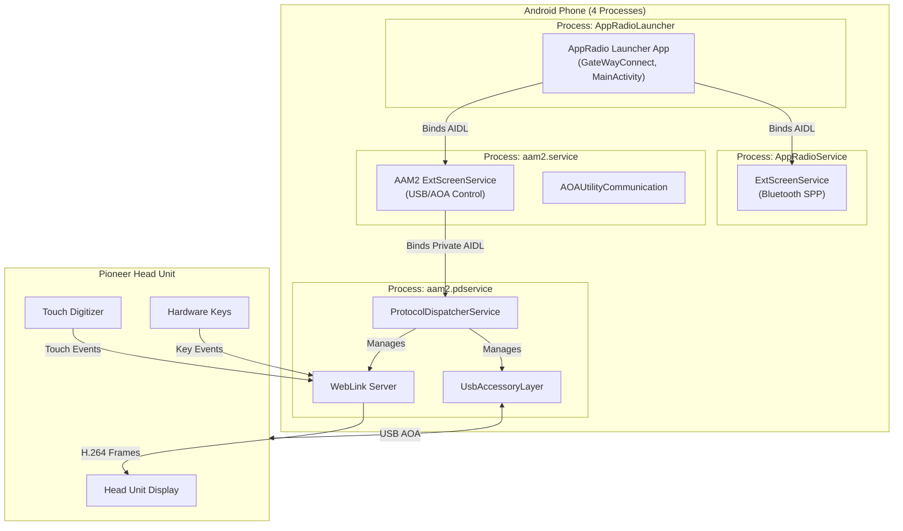
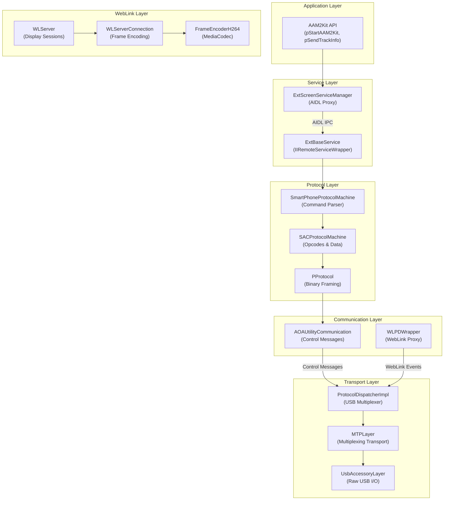
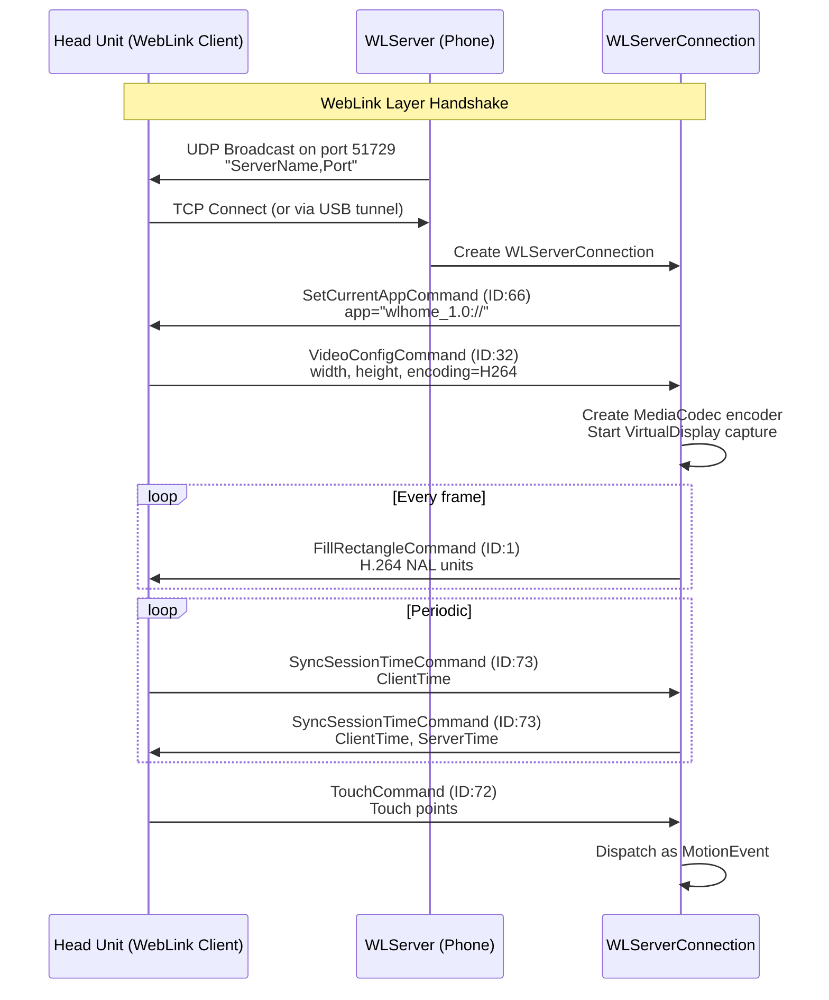
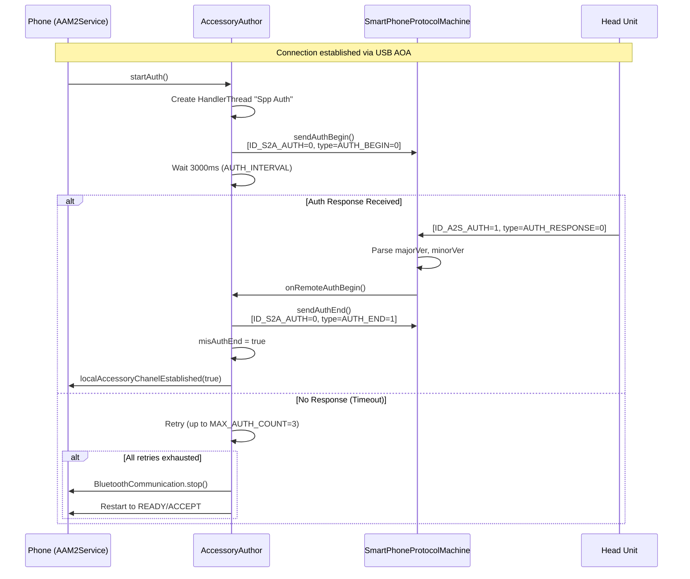
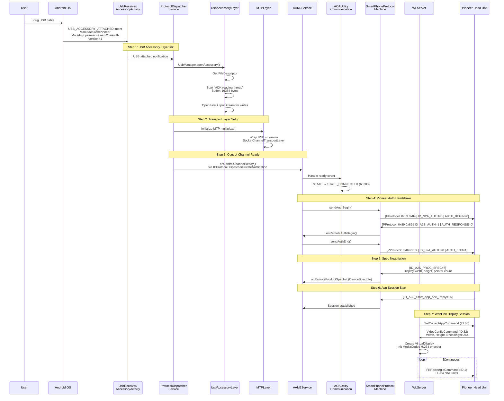
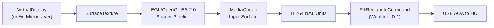
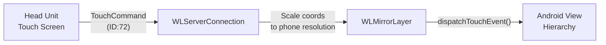
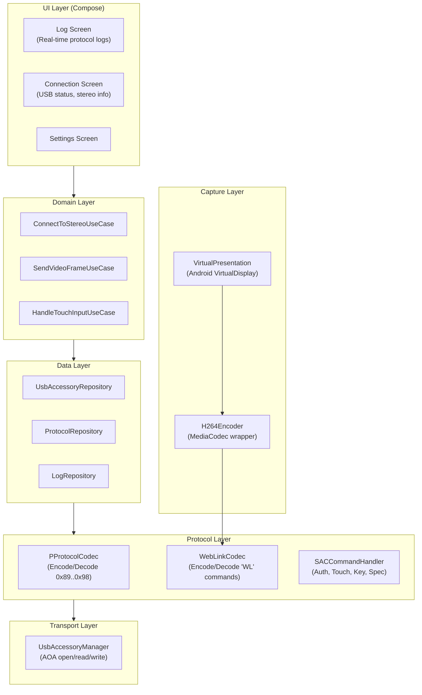

# Pioneer AppRadio Reverse Engineering — Complete Protocol & Architecture Agenda

> **Purpose**: This document is the single source of truth for understanding how the original Pioneer AppRadio APK communicates with Pioneer car stereo head units. It will guide the development of our new app that uses Android Virtual Display to mirror content to the stereo.

---

## Table of Contents

1. [Project Overview & Goals](#1-project-overview--goals)
2. [Original App Identity](#2-original-app-identity)
3. [Architecture Overview](#3-architecture-overview)
4. [Connection Modes: AAM1 vs AAM2](#4-connection-modes-aam1-vs-aam2)
5. [AAM2 Protocol Deep Dive (Our Target)](#5-aam2-protocol-deep-dive-our-target)
6. [WebLink Protocol Specification](#6-weblink-protocol-specification)
7. [PProtocol Binary Framing (Pioneer Proprietary)](#7-pprotocol-binary-framing-pioneer-proprietary)
8. [SAC Protocol — Command Opcodes & Message Types](#8-sac-protocol--command-opcodes--message-types)
9. [Authentication & Handshake](#9-authentication--handshake)
10. [Complete Connection Sequence (USB Plug → Session Active)](#10-complete-connection-sequence-usb-plug--session-active)
11. [Heartbeat & Keepalive Mechanisms](#11-heartbeat--keepalive-mechanisms)
12. [Screen Mirroring & H.264 Video Encoding](#12-screen-mirroring--h264-video-encoding)
13. [Touch & Input Relay](#13-touch--input-relay)
14. [Stereo/WebLink Commands Reference Table](#14-stereoweblink-commands-reference-table)
15. [Remote Control & Media Commands](#15-remote-control--media-commands)
16. [USB Accessory Configuration](#16-usb-accessory-configuration)
17. [IPC Architecture (4 Processes)](#17-ipc-architecture-4-processes)
18. [App Certification & Security](#18-app-certification--security)
19. [Head Unit Model IDs & Display Specs](#19-head-unit-model-ids--display-specs)
20. [Vehicle Safety Features](#20-vehicle-safety-features)
21. [Modern Android Replacement Strategy](#21-modern-android-replacement-strategy)
22. [New App Architecture Plan](#22-new-app-architecture-plan)
23. [Phase 1: Live Log Skeleton App](#23-phase-1-live-log-skeleton-app)

---

## 1. Project Overview & Goals

We are building a **new Android app** that connects to a **Pioneer car stereo head unit** and mirrors our app's UI onto the stereo display, similar to how the original AppRadio works but using a **modern Android Virtual Display** approach.

**Key goals:**
- Replace the proprietary AppRadio app with our own implementation
- Use the **AAM2 protocol** (USB AOA + WebLink) — this is our primary target
- Use Android **Virtual Display** + **MediaProjection** for screen capture
- Use **MediaCodec** for hardware H.264 encoding
- Build with **modern Android best practices** (Jetpack Compose, Kotlin, Clean Architecture)
- **Phase 1**: Build a live log app for protocol debugging and sharing

---

## 2. Original App Identity

| Property | Value |
|---|---|
| **Package Name** | `jp.pioneer.mbg.appradio.AppRadioLauncher` |
| **Version** | 2.8.11 (versionCode 31) |
| **Compile SDK** | 28 (Android 9) |
| **Min SDK** | 19 (Android 4.4) |
| **Target SDK** | 29 (Android 10) |
| **Application Class** | `AAM2ServerApp` → extends `AppRadiaoLauncherApp` |
| **Launcher Activity** | `GateWayConnect` |

---

## 3. Architecture Overview



The system operates across **4 Android processes**, communicating via AIDL IPC, with the USB accessory layer and WebLink server running in the Protocol Dispatcher process.

---

## 4. Connection Modes: AAM1 vs AAM2

| Feature | AAM1 (Legacy) | AAM2 (Our Target) |
|---|---|---|
| **Transport** | Bluetooth SPP (RFCOMM) | USB AOA (Android Open Accessory) |
| **Video** | Physical HDMI cable | H.264 over USB (no HDMI needed) |
| **SDK** | `PioneerKit` | `AAM2Kit` + Abaltatech WebLink |
| **UUID/Filter** | `06d12392-19da-11e1-b377-000c29c2b35c` | Manufacturer: `Pioneer`, Model: `jp.pioneer.ce.aam2.linkwith` |
| **Protocol** | PFormat (native JNI) | PProtocol (Java) + WebLink Commands |
| **Keepalive** | 15s BT data timeout | WebLink `SyncSessionTime` (ID: 73) |

> [!IMPORTANT]
> **We are targeting AAM2 exclusively.** AAM1 details are provided for reference only.

---

## 5. AAM2 Protocol Deep Dive (Our Target)

### 5.1 Layer Stack



### 5.2 AAM2Kit SDK — Public API

The `AAM2Kit` class provides static methods that map to AIDL IPC calls:

```
// Lifecycle
AAM2Kit.pStartAAM2Kit(Context)      → Starts the AAM2 service
AAM2Kit.pStopAAM2Kit(Context)       → Stops the AAM2 service

// Protocol Dispatcher
AAM2Kit.pConnectProtocolDispatcher() → Binds to ProtocolDispatcherService
AAM2Kit.pDisconnectProtocolDispatcher()

// USB Accessory
AAM2Kit.pOnAccessoryAttached()       → Called when USB accessory detected

// Listeners
AAM2Kit.pRegisterLocationListener(IAAM2LocationListener)
AAM2Kit.pRegisterRemoteCtrlListener(IAAM2RemoteCtrlListener)
AAM2Kit.pRegisterMediaInfoReqListener(IAAM2MediaInfoReqListener)
AAM2Kit.pRegisterAppFocusListener(IAAM2AppFocusListener)

// Media Info
AAM2Kit.pSendTrackInfo(int type, byte[] data)
AAM2Kit.pSetMediaPlayerStatus(int status)
```

**Constants:**
| Constant | Value | Description |
|---|---|---|
| `AAM2_LOCATION_INFO_ACCURACY_COARSE` | 100 | GPS coarse accuracy |
| `AAM2_LOCATION_INFO_ACCURACY_FINE` | 10 | GPS fine accuracy |
| `AAM2_REMOTE_CTRL_CMD_AV_TOGGLE` | 0 | Play/Pause toggle |
| `AAM2_REMOTE_CTRL_CMD_AV_PLAY` | 1 | Play |
| `AAM2_REMOTE_CTRL_CMD_AV_PAUSE` | 2 | Pause |
| `AAM2_REMOTE_CTRL_CMD_AV_TRACKUP` | 3 | Next track |
| `AAM2_REMOTE_CTRL_CMD_AV_TRACKDOWN` | 4 | Previous track |
| `AAM2_REMOTE_CTRL_CMD_AV_FF` | 5 | Fast forward |
| `AAM2_REMOTE_CTRL_CMD_AV_RW` | 6 | Rewind |
| `AAM2_TRACKINFO_TYPE_TITLE` | 3 | Track title |
| `AAM2_TRACKINFO_TYPE_ARTIST` | 4 | Track artist |
| `AAM2_TRACKINFO_TYPE_ALBUM` | 5 | Track album |
| `AAM2_TRACKINFO_TYPE_ELAPSED_TIME` | 6 | Elapsed time |

---

## 6. WebLink Protocol Specification

> [!IMPORTANT]
> This is the **wire protocol** used between the WebLink Server (phone) and the Pioneer Head Unit for display streaming and input. This is the most critical section for our implementation.

### 6.1 WebLink Command Format (8-byte header)

Every WebLink message follows this structure:

```
Offset  Size    Field           Value/Description
───────────────────────────────────────────────────
0       1       Magic Byte 1    0x57 ('W')
1       1       Magic Byte 2    0x4C ('L')
2       2       Command ID      uint16 (see Command ID table)
4       4       Payload Size    uint32 (size of payload only, not header)
8       N       Payload         Variable (N = Payload Size)
```

**Total packet size** = 8 + Payload Size

**Validation**: A valid command has bytes[0]==0x57, bytes[1]==0x4C, and `getInt(4) == totalSize - 8`.

### 6.2 WebLink Command IDs

| Command ID | Hex | Name | Direction | Description |
|---|---|---|---|---|
| 1 | 0x01 | `FILL_RECTANGLE` | S→HU | Video frame (H.264 NAL units) |
| 16 | 0x10 | `MOUSE_COMMAND` | HU→S | Legacy mouse events |
| 17 | 0x11 | `KEYBOARD_COMMAND` | HU→S | Physical keyboard events |
| 18 | 0x12 | `BROWSER_COMMAND` | HU→S | Back/forward navigation (keycode 4 = BACK) |
| 19 | 0x13 | `SHOW_KEYBOARD` | S→HU | Request virtual keyboard display |
| 20 | 0x14 | `HIDE_KEYBOARD` | S→HU | Hide virtual keyboard |
| 21 | 0x15 | `WAIT_INDICATOR` | S→HU | Show loading indicator |
| 32 | 0x20 | `VIDEO_CONFIG` | HU→S | Client requests video configuration |
| 48 | 0x30 | `RECONNECT` | Both | Reconnection request |
| 64 | 0x40 | `SETUP_SCROLL` | S→HU | Configure scroll areas |
| 65 | 0x41 | `SCROLL_UPDATE` | HU→S | Scroll gesture data |
| **66** | **0x42** | **`SET_CURRENT_APP`** | **S→HU** | **Identifies the active app (e.g., `wlhome_1.0://`)** |
| 67 | 0x43 | `START_AUDIO` | S→HU | Begin audio streaming |
| 68 | 0x44 | `STOP_AUDIO` | S→HU | Stop audio streaming |
| 69 | 0x45 | `AUDIO_DATA` | S→HU | Audio sample data |
| 70 | 0x46 | `PAUSE_AUDIO` | S→HU | Pause audio |
| **71** | **0x47** | **`SET_FPS`** | **HU→S** | **Sets desired frame rate (clamped 1-30)** |
| **72** | **0x48** | **`TOUCH_COMMAND`** | **HU→S** | **Multi-touch events from stereo** |
| **73** | **0x49** | **`SYNC_SESSION_TIME`** | **Both** | **Heartbeat / session keepalive** |
| 74 | 0x4A | `FRAME_DIAGNOSTIC` | S→HU | Frame diagnostics |

> **S→HU** = Server (Phone) to Head Unit, **HU→S** = Head Unit to Server (Phone)

### 6.3 Video Frame Format (`FILL_RECTANGLE`, ID: 1)

After the 8-byte WebLink header, the payload contains:

```
Offset  Size    Field           Description
───────────────────────────────────────────────
0       4       width           Frame width (int32)
4       4       height          Frame height (int32)
8       4       encoding type   0=None, 1=I420, 2=H.264, 4=XOR
12      4       appID           Application identifier
16      N       frame data      Encoded NAL units (H.264) or raw pixels
```

**Encoding Types:**
| Value | Name | Description |
|---|---|---|
| 0 | `FRAME_ENCODING_NONE` | Raw uncompressed frame |
| 1 | `FRAME_ENCODING_I420` | YUV I420 format |
| **2** | **`FRAME_ENCODING_H264`** | **H.264 encoded (our target)** |
| 4 | `FRAME_ENCODING_XOR` | XOR delta encoding |

### 6.4 Touch Event Format (`TOUCH_COMMAND`, ID: 72)

```
Offset  Size    Field           Description
───────────────────────────────────────────────
0       4       EventType       0=Begin, 1=Update, 2=End
4       4       Count           Number of touch points

Per touch point (20 bytes each):
───────────────────────────────────────────────
+0      4       id              Pointer ID
+4      4       posX            X coordinate (int32)
+8      4       posY            Y coordinate (int32)
+12     4       state           1=Pressed, 2=Moved, 4=Stationary, 8=Released
+16     4       pressure        Float (touch pressure)
```

**Total touch payload size** = 8 + (Count × 20)

### 6.5 Session Sync / Heartbeat (`SYNC_SESSION_TIME`, ID: 73)

```
Offset  Size    Field           Description
───────────────────────────────────────────────
0       8       ClientTime      Client uptime (long, ms)
8       8       ServerTime      Server uptime (long, ms)
```

**Fixed payload size** = 16 bytes

**Behavior**: When the server receives this from the head unit, it echoes back with the client's time preserved and `ServerTime` set to `SystemClock.uptimeMillis()`.

### 6.6 Video Config Request (`VIDEO_CONFIG`, ID: 32)

Sent by the head unit to negotiate display parameters:
- Source width/height (what the phone captures)
- Client width/height (what the head unit can display)
- Encoding type preference

### 6.7 Session Establishment Flow



---

## 7. PProtocol Binary Framing (Pioneer Proprietary)

> [!IMPORTANT]
> This is the **inner protocol** used for Pioneer-specific control messages (auth, touch relay, key events, GPS data) that travel over the WebLink control channel. It wraps SAC protocol commands.

### 7.1 PProtocol Packet Structure

```
Offset  Size    Field           Value/Description
───────────────────────────────────────────────────
0       1       Header Byte 1   0x89 (-119 signed)
1       1       Header Byte 2   0x89 (-119 signed)
2       4       Package Size    int32 (total size = HEADER_LENGTH + payload + TAIL_LENGTH)
6       4       Count/Sequence  int32 (incrementing packet counter, s_count)
10      4       SDK Version     int32 (Build.VERSION.SDK_INT)
14      4       Type            int32 (0=SAC Payload, 1=MotionEvent, 2=KeyEvent)
18      N       Payload Data    byte[] (SAC command data)
18+N    1       Tail Byte 1     0x98 (-104 signed)
19+N    1       Tail Byte 2     0x98 (-104 signed)
20+N    4       CRC             int32 (simple sum of all bytes before CRC)
```

**Key Constants:**
| Constant | Value | Description |
|---|---|---|
| `HEADER_LENGTH` | 22 | Fixed header size (2+4+4+4+4+4 bytes before payload) |
| `TAIL_LENGTH` | 2 | Tail marker size |
| `CRC_LENGTH` | 4 | CRC checksum size |
| `PKGDATA_SIZE` | 1024 | Fixed packet buffer size (all packets padded to 1024 bytes) |
| `s_header` | `{0x89, 0x89}` | Magic header bytes |
| `s_tail` | `{0x98, 0x98}` | Magic tail bytes |

### 7.2 PProtocol Type Field

| Type Value | Constant | Description |
|---|---|---|
| 0 | `TYPE_INVALID` / SAC Payload | SAC protocol command (auth, spec, screen, etc.) |
| 1 | `TYPE_MOTIONEVENT` | Serialized Android MotionEvent |
| 2 | `TYPE_KEYEVENT` | Serialized Android KeyEvent |

### 7.3 CRC Calculation

The CRC is a **simple arithmetic sum** of all bytes in the packet (from header through tail, excluding CRC itself):

```java
int caculateCRC(byte[] data, int length) {
    int crc = 0;
    for (int i = 0; i < length; i++) {
        crc += data[i];  // signed byte arithmetic
    }
    return crc;
}
```

### 7.4 Packet Construction (pkgData)

```java
// Write header: 0x89 0x89
// Write packageSize: int32 (data.length + 22 + 2)
// Write s_count: int32 (auto-incrementing)
// Write SDK_INT: int32
// Write type: int32 (0, 1, or 2)
// Write data: byte[] (SAC payload)
// Write tail: 0x98 0x98
// Calculate CRC over everything written so far
// Write CRC: int32
// Pad entire buffer to exactly 1024 bytes
```

---

## 8. SAC Protocol — Command Opcodes & Message Types

### 8.1 Smartphone → Accessory (S2A) Commands

| Opcode | Hex | Constant | Description |
|---|---|---|---|
| 0 | 0x00 | `ID_S2A_AUTH` | Send authentication (begin/end) |
| 2 | 0x02 | `ID_S2A_TERMINATION` | Terminate session |
| 6 | 0x06 | `ID_S2A_PROC_SPEC` | Send phone spec info |
| 16 | 0x10 | `ID_S2A_Start_App_Acc` | Start app accessory mode |
| 17 | 0x11 | `ID_S2A_End_App_Acc` | End app accessory mode |
| 18 | 0x12 | `ID_S2A_Start_App_Info_Reply` | App info reply start |
| 19 | 0x13 | `ID_S2A_End_App_Info_Reply` | App info reply end |
| 20 | 0x14 | `ID_S2A_Start_Accessory_Info` | Start accessory info |
| 21 | 0x15 | `ID_S2A_End_Accessory_Info` | End accessory info |
| 33 | 0x21 | `ID_S2A_PACKAGE_MEDIA` | Media package info |
| 66 | 0x42 | `ID_S2A_KEY` | Send key event |
| 80 | 0x50 | `ID_S2A_SMARTPHONE_AUDIOFOCUS_REPLAY` | Audio focus reply |
| 82 | 0x52 | `ID_S2A_SCREEN` | Screen command |
| 84 | 0x54 | `ID_S2A_VOICE_CMD` | Voice command |
| 85 | 0x55 | `ID_S2A_VOICE_CMD_REPLY` | Voice command reply |
| 96 | 0x60 | `ID_S2A_ACCESSORY_STATUS` | Accessory status |
| 99 | 0x63 | `ID_S2A_NOTIFICATION` / `GUIDESOUND` | Notification/guide sound |
| 112 | 0x70 | `ID_S2A_APPNINFO_RELY` | App info reply |
| 114 | 0x72 | `ID_S2A_TRACKNFO_RELY` | Track info reply |
| 120 | 0x78 | `ID_S2A_APPIMAGE_TRANSFER_NOTIFICATION` | App image transfer start |

### 8.2 Accessory → Smartphone (A2S) Commands

| Opcode | Hex | Constant | Description |
|---|---|---|---|
| 1 | 0x01 | `ID_A2S_AUTH` | Auth response from head unit |
| 3 | 0x03 | `ID_A2S_TERMINATION` | Terminate session |
| 7 | 0x07 | `ID_A2S_PROC_SPEC` | Product spec info (display resolution, capabilities) |
| 16 | 0x10 | `ID_A2S_Start_App_Acc_Reply` | Start app accessory mode reply |
| 17 | 0x11 | `ID_A2S_VEDIO_OUTPUT` / `End_App_Acc_Reply` | Video output / End app reply |
| 18 | 0x12 | `ID_A2S_Start_App_Info` | Start app info |
| 19 | 0x13 | `ID_A2S_End_App_Info` | End app info |
| 20 | 0x14 | `ID_A2S_Start_Accessory_Info_Reply` | Accessory info reply |
| 21 | 0x15 | `ID_A2S_End_Accessory_Info_Reply` | End accessory info reply |
| 49 | 0x31 | `ID_A2S_LOCATIONMAILDATA` | GPS/location data |
| 51 | 0x33 | `ID_A2S_SENSOR` | Sensor data |
| 53 | 0x35 | `ID_A2S_GEOLOCATIONDATA` | Geo-location data |
| 65 | 0x41 | `ID_A2S_KEY` | Key event from head unit |
| 67 | 0x43 | `ID_A2S_TOUCH` | Touch event from head unit |
| 81 | 0x51 | `ID_A2S_REMOTECTRL` | AV remote control command |
| 83 | 0x53 | `ID_A2S_APPS` | App list request |
| 85 | 0x55 | `ID_A2S_VOICE_CMD_REPLY` | Voice recognition reply |
| 97 | 0x61 | `ID_A2S_PACKAGEINFO` | Package info request |
| 98 | 0x62 | `ID_A2S_NOTIFYREQUEST` | Notification request |
| 113 | 0x71 | `ID_A2S_APPINFO_REQUEST` | App info request |
| 115 | 0x73 | `ID_A2S_TRACKNFO_REQUEST` | Track info request |
| 121 | 0x79 | `ID_A2S_APPIMAGE_TRANSFER_REQUEST` | App image transfer request |

### 8.3 Auth Sub-Types

| Constant | Value | Description |
|---|---|---|
| `AUTH_BEGIN` | 0 | Phone sends to initiate authentication |
| `AUTH_END` | 1 | Authentication complete |
| `AUTH_RESPONSE` | 0 | Head unit auth response type |
| `AUTH_SUCCESS` | 1 | Authentication succeeded |
| `AUTH_FAIL` | 0 | Authentication failed |

### 8.4 Accessory Types

| Constant | Value | Description |
|---|---|---|
| `ACCESSORY_TYPE_CRADLE` | 0 | Basic cradle |
| `ACCESSORY_TYPE_SIMDRIVE` | 1 | Sim drive mode |
| `ACCESSORY_TYPE_Open_UsingName` | 1 | Open using app name |
| `ACCESSORY_TYPE_Open_UsingAppToken` | 2 | Open using app token |
| `ACCESSORY_TYPE_LINKWITH_AAM2` | 8 | LinkWith AAM2 (our target) |
| `ACCESSORY_TYPE_UNKNOWN` | 255 | Unknown type |

### 8.5 Touch Constants

| Constant | Value | Description |
|---|---|---|
| `ACCESSORY_TOUCH_INVALID` | 0 | No touch |
| `ACCESSORY_TOUCH_DOWN` | 1 | Finger down |
| `ACCESSORY_TOUCH_MOVE` | 2 | Finger move |
| `ACCESSORY_TOUCH_RELEASE` | -1 | Finger lifted |

### 8.6 Key Constants

| Constant | Value | Description |
|---|---|---|
| `ACCESSORY_KEYCODE_INVALID` | 0 | No key |
| `ACCESSORY_KEYCODE_HOME` | 1 | Home button |
| `ACCESSORY_KEYCODE_MENU` | 1 | Menu button |
| `ACCESSORY_KEYCODE_BACK` | 2 | Back button |
| `ACCESSORY_KEYACTION_KEYDOWN` | 1 | Key pressed |
| `ACCESSORY_KEYACTION_KEYHOLDING` | 2 | Key held |
| `ACCESSORY_KEYACTION_KEYRELEASE` | -1 | Key released |

### 8.7 Version Constants

| Constant | Value |
|---|---|
| `APPRADIO_MAJOR_VERSION` | 3 |
| `APPRADIO_MINOR_VERSION` | 1 |

---

## 9. Authentication & Handshake

### 9.1 Authentication Flow



### 9.2 Authentication Parameters

| Parameter | Value |
|---|---|
| **Auth Interval** | 3000ms (wait time for response) |
| **Max Retries** | 3 (`MAX_AUTH_COUNT`) |
| **Auth States** | `AUTH_UNKNOWN=0`, `AUTH_ING=1`, `AUTH_END=2` |

### 9.3 App Certification

For 3rd party app verification, the system uses:

```
Hash = MD5(MD5(packageName + "PionnerKit"))
```

> [!NOTE]
> The salt is `"PionnerKit"` — note the intentional(?) misspelling of "Pioneer".

**Hardcoded certifications:**
```
AppRadio:  ExtCertifiedInfo("Pioneer", "jp.pioneer.mbg.appradio.AppRadioLauncher", "cc8116896fab216025f7dda114f9107f")
DOP:       ExtCertifiedInfo("Pioneer", "jp.pioneer.mbgdop.appradio.AppRadioLauncher", "01fc011abd9e9b24176ff811cebac72c")
```

---

## 10. Complete Connection Sequence (USB Plug → Session Active)



---

## 11. Heartbeat & Keepalive Mechanisms

### 11.1 WebLink Level — SyncSessionTime

The primary keepalive for AAM2 connections:

- **Command**: `SYNC_SESSION_TIME` (ID: 73)
- **Initiated by**: Head Unit (client)
- **Server response**: Echo back with `ClientTime` preserved, `ServerTime = SystemClock.uptimeMillis()`
- **Payload**: 16 bytes (two int64 timestamps)

```java
// Server handling:
void handleSyncSessionTime(SyncSessionTimeCommand cmd) {
    connection.sendCommand(new SyncSessionTimeCommand(
        cmd.getCurrentClientTime(),     // Echo client time back
        SystemClock.uptimeMillis()       // Add server time
    ));
}
```

### 11.2 Bluetooth Level — Data Timeout (AAM1 only)

For Bluetooth SPP connections:
- **Timeout**: 15000ms (`mBTDataTimeOut`)
- **Mechanism**: Handler posts a delayed runnable. Each data read resets the timer.
- **On timeout**: Drops BT connection and restarts to ready/accept state.

### 11.3 Socket Level Keepalive

The MCS SocketTransportLayer enables TCP keepalive on its sockets:
```java
this.m_clientSocket.setKeepAlive(true);
```

---

## 12. Screen Mirroring & H.264 Video Encoding

### 12.1 H.264 Encoder Configuration

From [`FrameEncoderH264`](file:///D:/AppDevelopment/AppRadioRE/decompiledApkFiles/sources/com/abaltatech/weblinkserver/FrameEncoderH264.java):

| Parameter | Value | Description |
|---|---|---|
| **MIME Type** | `video/avc` | H.264 AVC |
| **Default Bitrate** | 3,500,000 (3.5 Mbps) | `DEF_BIT_RATE` |
| **Default Frame Rate** | 2 FPS | `DEF_FRAME_RATE` |
| **I-Frame Interval** | 1 second | `i-frame-interval` |
| **Profile** | Baseline (1) | `AVCProfileBaseline` |
| **Level** | 3.1 (512) | `AVCLevel31` |
| **Color Format** | `COLOR_FormatSurface` (2130708361) | Surface input mode |
| **Max Resolution** | 1280×1280 | Capped per axis |
| **Dequeue Timeout** | 500ms | `kTimeOutUs = 500000` |
| **Max Failed Attempts** | 2 | Before encoder restart |

### 12.2 Encoder Modes

1. **Surface Input Mode** (SDK ≥ 18 / Android 4.3+):
   - Uses `encoder.createInputSurface()`
   - EGL context renders `SurfaceTexture` frames via OpenGL ES 2.0 shaders
   - Uses `GL_OES_EGL_image_external` extension

2. **Buffer Input Mode** (fallback):
   - Dequeue input buffers directly
   - Convert pixel format via JNI `convertColorFormat()`
   - Uses `DeviceH264EncoderSettings.COLOR_FORMAT`

### 12.3 Screen Capture Pipeline



### 12.4 FPS Control

The head unit can control frame rate via `SET_FPS` command (ID: 71):
- FPS is clamped between 1 and 30
- Capture interval = `1000 / fps` (milliseconds between frames)

---

## 13. Touch & Input Relay

### 13.1 WebLink Touch Flow



### 13.2 Touch Point Structure (per point)

```
struct TouchPoint {
    int32 id;        // Pointer ID (0, 1, 2, ...)
    int32 posX;      // X coordinate on HU display
    int32 posY;      // Y coordinate on HU display
    int32 state;     // 1=Pressed, 2=Moved, 4=Stationary, 8=Released
    float pressure;  // Touch pressure (0.0 - 1.0)
};
```

### 13.3 PProtocol Touch Events (Pioneer Layer)

When using the Pioneer protocol layer (SAC command `ID_A2S_TOUCH = 67`):
- Touch data includes pointer count, action type, X/Y coordinates
- Mapped to physical screen dimensions from `ProductSpecInfo`
- Dispatched via `LocalPEventInputManager` using reflection:
  - SDK < 16: `IWindowManager.injectPointerEvent()`
  - SDK >= 16: `IInputManager.injectInputEvent()`

### 13.4 Key Events

**BrowserCommand (WebLink ID: 18)**:
- Action 0 → dispatches KEYCODE_BACK (keycode 4) via `view.dispatchKeyEvent()`

**SAC Key Events (`ID_A2S_KEY = 65`)**:
- Key types: `ACTIONKEY=0`, `INPUTKEY=2`, `CMKKEY=3`
- Key options: `ACTION=0` (short press), `LONGACTION=1` (long press)

---

## 14. Stereo/WebLink Commands Reference Table

### 14.1 Complete WebLink Command Quick Reference

| ID | Name | Dir | Payload | Critical? |
|---|---|---|---|---|
| 1 | FILL_RECTANGLE | S→HU | 16B header + H.264 data | ✅ Video frames |
| 32 | VIDEO_CONFIG | HU→S | Resolution, encoding | ✅ Session setup |
| 66 | SET_CURRENT_APP | S→HU | App URL string | ✅ App identity |
| 71 | SET_FPS | HU→S | FPS value (1-30) | ✅ Frame rate |
| 72 | TOUCH_COMMAND | HU→S | Event + touch points | ✅ User input |
| 73 | SYNC_SESSION_TIME | Both | 2× int64 timestamps | ✅ Heartbeat |
| 18 | BROWSER_COMMAND | HU→S | Action (back/forward) | ⚠️ Navigation |
| 48 | RECONNECT | Both | - | ⚠️ Recovery |
| 67-70 | AUDIO_* | S→HU | Audio samples | 📌 Optional |
| 19-20 | KEYBOARD_* | S→HU | - | 📌 Optional |
| 64-65 | SCROLL_* | Both | Scroll data | 📌 Optional |
| 74 | FRAME_DIAGNOSTIC | S→HU | Diagnostic data | 📌 Debug |

---

## 15. Remote Control & Media Commands

### 15.1 AV Remote Control Commands (SAC ID: `ID_A2S_REMOTECTRL = 81`)

| Command | Value | Description |
|---|---|---|
| TOGGLE | 0 | Play/Pause toggle |
| PLAY | 1 | Play |
| PAUSE | 2 | Pause |
| TRACKUP | 3 | Next track |
| TRACKDOWN | 4 | Previous track |
| FF | 5 | Fast forward |
| RW | 6 | Rewind |
| RATINGUP | 33 | Rating up |
| RATINGDOWN | 34 | Rating down |

### 15.2 Track Info Types

| Type | Value | Description |
|---|---|---|
| SETTING | 1 | Track settings |
| INFO | 2 | Track info update |
| TITLE | 3 | Track title |
| ARTIST | 4 | Artist name |
| ALBUM | 5 | Album name |
| ELAPSED_TIME | 6 | Elapsed playback time |

### 15.3 Smartphone Source Types

| Source | Value | Description |
|---|---|---|
| INVALID | 0 | No source |
| TUNER | 1 | Radio tuner |
| REARCAMERA | 2 | Rear camera |
| PHONE | 3 | Phone call |
| SETTING | 4 | Settings |
| IPOD | 5 | iPod/Music |

---

## 16. USB Accessory Configuration

### 16.1 Accessory Filter (`accessory_filter.xml`)

```xml
<usb-accessory
    manufacturer="Pioneer"
    model="jp.pioneer.ce.aam2.linkwith"
    version="1" />
```

### 16.2 USB Layer Details

| Parameter | Value |
|---|---|
| **Read Buffer** | 16384 bytes |
| **Thread Name** | "ADK reading thread" |
| **Write** | `FileOutputStream` on USB FileDescriptor |
| **Read** | `FileInputStream` on USB FileDescriptor |
| **Broadcast Port** | 51729 (WebLink UDP discovery) |

### 16.3 Handler Message IDs

| Constant | Value | Description |
|---|---|---|
| `AOA_C_MSG` | 65520 | AOA connection state update |

---

## 17. IPC Architecture (4 Processes)

### 17.1 Process Map

| # | Process Name | Purpose | Key Service |
|---|---|---|---|
| 1 | `jp.pioneer.mbg.appradio.AppRadioLauncher` | Main UI | Activities |
| 2 | `jp.pioneer.mbg.appradio.AppRadioService` | AAM1 Background | `ExtScreenService` |
| 3 | `jp.pioneer.ce.aam2.service` | AAM2 Background | AAM2 `ExtScreenService` |
| 4 | `com.abaltatech.aam2.pdservice` | Protocol Dispatcher | `ProtocolDispatcherService` |

### 17.2 AIDL Interfaces

| Interface | Binding Action | Purpose |
|---|---|---|
| `ISppControl` | `com.extscreen.service` | AAM1 service control |
| `ISppControl` | `jp.pioneer.ce.aam2service` | AAM2 service control |
| `IPProtocolDispatcher` | `abaltatech.intent.action.bindProtocolDispatcherService` | WebLink public API |
| `IPProtocolDispatcherPrivate` | `abaltatech.intent.action.bindProtocolDispatcherPrivateService` | Control channel |

### 17.3 Key Permissions

```xml
<!-- Custom Pioneer permissions (signature-level) -->
<permission android:name="pioneer.permission.appradio.AV_APP_CTRL_MODE" />
<permission android:name="pioneer.permission.appradio.ADVANCED_APPMODE" />
<permission android:name="pioneer.permission.appradio.AAM2" />

<!-- Critical system permissions -->
<uses-permission android:name="android.permission.INJECT_EVENTS" />
<uses-permission android:name="android.permission.SYSTEM_ALERT_WINDOW" />
<uses-permission android:name="android.permission.GET_TASKS" />
<uses-permission android:name="android.permission.PACKAGE_USAGE_STATS" />
```

---

## 18. App Certification & Security

### 18.1 HDMI Certified Package

The `HDMICertifiedPackage` encodes foreground app status in a single byte:

```
Bit Layout:
[7] [6]              [5]                   [4:2] [1]              [0]
     geoLocationReq   soundInterruptionReq        foregroundInfo    locationRequest
```

### 18.2 App Image Types

| Type | Value |
|---|---|
| BMP | 2 |
| JPG | 3 |
| PNG | 18 |
| APPICON (kind) | 16 |

---

## 19. Head Unit Model IDs & Display Specs

### 19.1 Model Categories

| Category | Model IDs |
|---|---|
| **Japan Domestic** | 2, 3, 7, 8, 769, 770, 8194, 8195, 8961-8966, 4107, 4111 |
| **Overseas** | 1, 4-6, 9-12, 4097-4114, 8193, 8196, 8199-8204 |
| **Default AppRadio** | 8194 (0x2002) |
| **Default DOP** | 8961 (0x2301) |

### 19.2 Display Spec Info (from `ProductSpecInfo`)

The head unit reports:
- `remotePhysicalWidth` — Physical display width in pixels
- `remotePhysicalHeight` — Physical display height in pixels
- Pointer count (touch support level 1, 2, or 3)
- Location device type (GPS capability)

---

## 20. Vehicle Safety Features

### 20.1 Parking Brake Detection

- Head unit reports parking brake state via `onRemoteParkingInfo()` / `onRemoteBooleanParkingInfo()`
- `ACCESSORY_PARK = 32` — Parking notification type
- When brake is off (driving): certain features are locked

### 20.2 Screen Transitions

| Screen | Value | Description |
|---|---|---|
| HOME | 0 | Go to home screen |
| PANDORA | 1 | Pandora music screen |
| TRANSITION | 0 | Generic screen transition |

---

## 21. Modern Android Replacement Strategy

> [!WARNING]
> The original app uses many deprecated/restricted APIs. Our new app needs modern replacements.

### 21.1 API Replacements

| Original Approach | Issue | Our Replacement |
|---|---|---|
| `getRunningTasks()` | Deprecated/restricted | Not needed (we ARE the app) |
| `INJECT_EVENTS` | System-only permission | `VirtualDisplay` + `Instrumentation` or Accessibility |
| `SYSTEM_ALERT_WINDOW` | Heavily restricted | Not needed with VirtualDisplay approach |
| HDMI output | Removed from most phones | `MediaProjection` + `VirtualDisplay` |
| `BluetoothCommunication` (SPP) | AAM1 only | Not needed (using USB AOA) |
| WebLink `WLMirrorLayer` reflection | Fragile, breaks on updates | `MediaProjection` API |
| Facebook/Twitter SDKs | Deprecated | Remove entirely |
| PFormat JNI (libPFormat.so) | AAM1 only | PProtocol Java (already available for AAM2) |

### 21.2 Modern Architecture Stack

| Layer | Technology |
|---|---|
| **UI** | Jetpack Compose |
| **Architecture** | MVI (State, Action, Event) |
| **DI** | Koin |
| **Navigation** | Compose Navigation (type-safe) |
| **USB Communication** | `UsbManager` + USB Accessory API |
| **Screen Capture** | `MediaProjection` + `VirtualDisplay` |
| **Video Encoding** | `MediaCodec` (hardware H.264) |
| **Protocol** | Custom Kotlin implementation of PProtocol + WebLink |
| **Logging** | Timber + custom log capture |
| **Async** | Kotlin Coroutines + Flow |

---

## 22. New App Architecture Plan



---

## 23. Phase 1: Live Log Skeleton App

### 23.1 Purpose

Before implementing the full mirroring, we build a **live logging app** that:
1. Connects to the Pioneer stereo via USB AOA
2. Performs the PProtocol handshake
3. Logs every protocol message in real-time
4. Makes logs shareable for debugging
5. Provides a foundation for the full app

### 23.2 Feature List

- [ ] USB Accessory detection and connection
- [ ] PProtocol frame encoding/decoding
- [ ] SAC command parsing
- [ ] WebLink command parsing
- [ ] Real-time log display (Compose LazyColumn)
- [ ] Log filtering by command type
- [ ] Log export (share as file)
- [ ] Connection state display
- [ ] Head Unit spec info display (when received)
- [ ] Auth handshake execution and logging

### 23.3 Module Structure

```
:app                     — Main application entry point, DI wiring
:core:protocol           — PProtocol, WebLink, SAC codec implementations
:core:usb                — USB Accessory layer
:core:logging            — Log capture and storage
:feature:livelog          — Live log screen UI + ViewModel
:feature:connection       — Connection management UI + ViewModel
```

### 23.4 Key Classes to Implement

```kotlin
// Protocol Layer
class PProtocolCodec {
    fun encode(type: Int, data: ByteArray): ByteArray  // → 1024-byte packet
    fun decode(packet: ByteArray): PProtocolFrame?     // → parsed frame
}

data class PProtocolFrame(
    val sequence: Int,
    val sdkVersion: Int,
    val type: Int,           // 0=SAC, 1=MotionEvent, 2=KeyEvent
    val payload: ByteArray
)

class WebLinkCodec {
    fun encode(commandId: Short, payload: ByteArray): ByteArray
    fun decode(data: ByteArray): WebLinkCommand?
}

data class WebLinkCommand(
    val commandId: Short,
    val payloadSize: Int,
    val payload: ByteArray
)

class SACCommandParser {
    fun parse(opcode: Int, data: ByteArray): SACCommand
}

sealed class SACCommand {
    data class Auth(val type: Int, val majorVer: Int, val minorVer: Int) : SACCommand()
    data class ProductSpec(val width: Int, val height: Int, val pointerCount: Int) : SACCommand()
    data class Touch(val action: Int, val x: Int, val y: Int) : SACCommand()
    data class Key(val keyCode: Int, val action: Int) : SACCommand()
    data class RemoteCtrl(val command: Int) : SACCommand()
    data class Location(val lat: Double, val lon: Double) : SACCommand()
    // ... etc
}

// USB Layer
class UsbAccessoryManager(context: Context) {
    val connectionState: StateFlow<UsbConnectionState>
    fun connect(accessory: UsbAccessory): Result<UsbConnection>
    fun disconnect()
}

// Log Layer
class ProtocolLogger {
    val logs: Flow<List<ProtocolLogEntry>>
    fun log(direction: Direction, raw: ByteArray, parsed: Any)
    fun exportLogs(): File
}
```

---

## Appendix A: MCS TCP/IP Stack

> [!NOTE]
> Abaltatech's MCS layer includes a **userspace TCP/IP stack** (`TCPIPPacket.java`, `TCPIPLayer.java`) that parses raw IPv4 headers and TCP headers (maintains seqNo, ackNo, flags, calculates checksums). This tunnels raw TCP/IP over USB accessory mode to bypass Android networking restrictions without needing root/VPN/tethering.

---

## Appendix B: Configuration System

### DeviceInfo.xml
- Downloaded from Pioneer servers at runtime
- Defines per-model screen parameters (margins, AAM_VR support)
- Two server URLs: AppRadio and DOP variants

### Compatible App Lists
- `ApplicationInfomation` — massive XML parser for compatible app catalog
- `AplContentFilter` — filters installed apps by compatibility

---

## Appendix C: Broadcast Receivers

| Receiver | Trigger | Purpose |
|---|---|---|
| `AutoBootReceiver` | `BOOT_COMPLETED` | Auto-start service |
| `AutoStartReceiver` | `android.intent.action.AppRadioLauncher` | Custom start |
| `PackageChangeReceiver` | `PACKAGE_ADDED/REMOVED` | Refresh app list |
| `BluetoothHfpReceiver` | `ACL_CONNECTED` | Detect BT device |
| `UsbReceiver` | `USB_ACCESSORY_ATTACHED` | Detect USB accessory |

---

## Appendix D: Connection States

| State | Value (hex) | Description |
|---|---|---|
| `STATE_NONE` | 0xFF00 (65280) | No connection |
| `STATE_ACCEPT` | 0xFF01 (65281) | Waiting for connection |
| `STATE_CONNECTING` | 0xFF02 (65282) | Connection in progress |
| `STATE_CONNECTED` | 0xFF03 (65283) | Fully connected |
| `STATE_EXCEPTION` | 0xFF04 (65284) | Error state |

---

> **Document Status**: Compiled from deep analysis of decompiled APK source code in [`decompiledApkFiles/sources/`](file:///D:/AppDevelopment/AppRadioRE/decompiledApkFiles/sources).
> 
> **Next Steps**: Implement Phase 1 Live Log App using the protocol specifications documented above.
