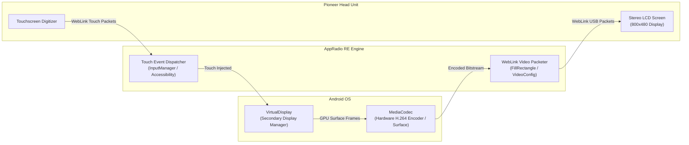

# Pioneer AppRadio RE: Developer & Testing Guide

## 1. Prerequisites & Environment

- **Android Studio**: Ladybug / Meerkat (or newer)
- **JDK**: JDK 17 or JDK 21
- **Gradle**: 9.7.1 (Wrapper included)
- **Android Gradle Plugin (AGP)**: 9.4.0
- **Kotlin**: 2.2.10
- **Android SDK Targets**:
  - `minSdk`: 33 (Android 13)
  - `targetSdk`: 37 (Android 15+)
  - `compileSdk`: 37

---

## 2. Building & Testing

### 2.1 Running Unit Tests
All protocol codecs, byte-stuffing framing, checksum calculation, circular log buffer, and the handshake state machine have full unit test coverage:
```bash
./gradlew testDebugUnitTest
```
To view the generated HTML test report:
```
app/build/reports/tests/testDebugUnitTest/index.html
```

### 2.2 Assembling the Debug APK
```bash
./gradlew assembleDebug
```
The resulting APK will be placed at:
```
app/build/outputs/apk/debug/app-debug.apk
```

### 2.3 Installing via ADB
Ensure your Android device has Developer Options and USB Debugging enabled:
```bash
adb install -r app/build/outputs/apk/debug/app-debug.apk
```

---

## 3. Testing the Application

### 3.1 Offline / Desk Testing (Simulation Mode)
You do not need to be in a car to test the app:
1. Launch **AppRadio RE** on your Android device or emulator.
2. In the top bar, tap the **Play (▶)** button (or tap the *"Run Simulated Pioneer Handshake"* button).
3. The app will simulate the full 6-step handshake:
   - Progress bar will indicate active state transitions.
   - Stereo spec badges will dynamically appear: `800x480 | Model: 0x0112 | Touch: 2 pts | GPS: Yes | Brake: ON`.
   - The log stream will populate with color-coded packets (`◄ RX`, `► TX`, `● SYS`).
4. **Inspect Packets**: Tap any packet row to open the inspector dialog. View decoded fields and tap **Copy Hex** to copy the wire bytes to your clipboard.
5. **Search & Filter**: Test filtering by `SAC`, `WebLink`, `USB`, or `SYS`, and search for specific commands (e.g. `Auth`, `Display`, `Touch`).
6. **Export & Share**: Tap the **Share** button in the top bar. Verify that Android's native ShareSheet launches with the formatted log file attached.

### 3.2 On-Hardware Testing (In Vehicle with Pioneer Head Unit)
1. Ensure your Pioneer stereo is set to **AppRadio Mode** (or **App Mode**) in its input settings.
2. Connect your phone via USB cable to the USB port labeled **USB 1** (or the smartphone-designated port).
3. A system prompt will appear on your phone: *"Open AppRadio RE when this USB accessory is connected?"*
   - Check *"Always open"* and tap **OK**.
4. The app will automatically launch, attach to the USB accessory, and begin the handshake.
5. Watch the log screen in real time:
   - You will see the incoming `AuthResponse` from your stereo.
   - The display specs for your specific stereo model will populate.
   - If the handshake finishes, the head unit screen will unlock.
6. **Sharing Hardware Logs**: If any issue occurs, tap the **Share** icon and email or upload the log file for immediate debugging.

---

## 4. Phase 2 Roadmap: VirtualDisplay & Video Mirroring

With Phase 1 (Protocol reverse engineering, codecs, USB transport, live logging, and handshake state machine) complete, the project proceeds to Phase 2:



### Key Components for Phase 2:
1. **`DisplayManager.createVirtualDisplay`**:
   - Create a private `VirtualDisplay` configured with the stereo's negotiated dimensions (e.g. $800 \times 480$ at $160\text{ dpi}$).
   - Set flags: `VIRTUAL_DISPLAY_FLAG_PRESENTATION` | `VIRTUAL_DISPLAY_FLAG_PUBLIC`.
2. **`MediaCodec` Video Streaming**:
   - Initialize `MediaCodec.createEncoderByType("video/avc")` (H.264 Baseline Profile).
   - Feed the encoder's input surface directly to the `VirtualDisplay`.
   - Wrap encoded NAL units into `WebLinkCommand.FillRectangle` packets and transmit over USB AOA.
3. **Reverse Touch Injection**:
   - Receive `WebLinkCommand.Touch` events.
   - Transform coordinates $(X_{stereo}, Y_{stereo})$ to the `VirtualDisplay` coordinate space.
   - Inject touch motions via Android `AccessibilityService` or `InputManager` to allow complete touch control of apps on the stereo screen.
