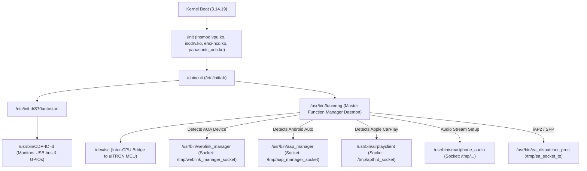

# Pioneer Car Stereo Head Unit Firmware & RootFS Deep Technical Analysis
**Target Model**: Pioneer AVH-Z2090BT & AppRadio Mode+ Series  
**Firmware Base**: Embedded Linux (Buildroot 2014.11 / Kernel 3.14.19) on Panasonic Gerda SoC + Renesas uITRON RTOS  
**Extracted RootFS Path**: `decompiledApkFiles/rootfs`

---

## 1. Executive Architectural Summary

Reverse engineering and binary analysis of the stereo's extracted firmware filesystem (`rootfs`) reveals an asymmetrical **Dual-CPU / Dual-OS Architecture**:

```
┌──────────────────────────────────────────────────────────────────────────────────┐
│                             PIONEER CAR STEREO HARDWARE                          │
├────────────────────────────────────────┬─────────────────────────────────────────┤
│    CPU 0: Application Processor        │       CPU 1: Real-Time MCU              │
│    Panasonic "Gerda" (ARMv7-A 32-bit)  │       Renesas / Proprietary Automotive  │
│    OS: Embedded Linux (Buildroot 2014) │       OS: uITRON 4.0 RTOS               │
├────────────────────────────────────────┼─────────────────────────────────────────┤
│ • USB Host / AOA Stack (`funcmng`)     │ • Pioneer Main System UI & Menus        │
│ • WebLink Client (`weblink_manager`)   │ • Tuner, CD/DVD, DSP, Hardware Volume   │
│ • Android Auto (`aap_manager`)         │ • CAN Bus, Reverse Gear, Parking Brake  │
│ • Apple CarPlay (`airplayclient`)      │ • Touchscreen Digitizer Hardware        │
│ • Hardware VPU (`omx_h264dec`)         │ • Display Switcher (LCD Plane Mux)      │
│ • Audio Routing (`smartphone_audio`)   │ • Pioneer SAC Protocol Engine           │
├────────────────────────────────────────┴─────────────────────────────────────────┤
│         INTER-CPU COMMUNICATIONS BRIDGE (ISC)                                    │
│         Hardware Shared Memory + Mailbox Interrupts                              │
│         Driver: `iscdrv.ko` (/dev/isc) | Userspace: `libisc.so`, `libcom.so`    │
└──────────────────────────────────────────────────────────────────────────────────┘
```

---

## 2. Hardware Platform & Kernel Specifications

| Attribute | Specification / Hardware Detail | Firmware Verification Source |
|---|---|---|
| **SoC / Chipset** | Panasonic Semiconductor Solutions **"Gerda"** (MN2WS series) | `init`, `libomxvpu.so`, `libConnectionManager.so` (`CAOAListener_GerdaC`) |
| **CPU Architecture** | **ARMv7-A** (32-bit Little-Endian, `EM_ARM 0x28`, Thumb-2) | ELF headers: `/usr/bin/weblink_manager`, `libc.so.6` |
| **Linux Kernel** | **Linux 3.14.19** (`/lib/modules/3.14.19/`) | Kernel modules directory structure |
| **Buildroot Version** | **Buildroot 2014.11-g415b5fb-dirty** | `/etc/os-release` |
| **C Library / Toolchain** | `glibc 2.19` (Linaro GCC 4.8-2014.04) | `/lib/libc.so.6`, compiler notes |
| **Hardware Video Decoder (VPU)** | Chips&Media CODA/WAVE hardware IP core (`vpu.ko`, `libvpu.so.0.0.0`) | `vdi_read_register`, `LoadBitCode`, `VPU_InitWithBitcode` |
| **OpenMAX IL Implementation** | OpenMAX Bellagio (`libomxil-bellagio.so`) | `/.omxregister`, `/etc/init.d/S70autostart` |
| **Bluetooth / Wi-Fi** | Broadcom Automotive BCM89335 / BCM4339 combo chip | `/lib/firmware/Automotive_BCM89335_...hcd`, `/etc/bluetooth/` |
| **Storage Architecture** | SPI NOR / NAND serial flash (`/dev/mtdblock0` = boot/sys, `/dev/mtdblock2` = `/data`) | `/usr/bin/data_mounter.sh`, `/usr/bin/rom_update` |
| **Serial Diagnostics** | UART console on `ttyS0` @ 115200 8N1 (`/sbin/getty -L ttyS0 115200 vt100`) | `/etc/inittab` |

---

## 3. System Initialization & Daemon Topology

The head unit boots from `/init` into Busybox `/sbin/init` via `/etc/inittab`:



### Key Daemons in `/usr/bin`:

1. **`funcmng` (Master Function Manager)**:
   - Primary supervisor daemon spawned on serial console.
   - Monitors physical USB ports (`/sys/bus/usb/devices/usb1/`, `usb2/`).
   - Handles AOA protocol switching (`HOST_AOA1_CONNECTED`, `HOST_AOA2_CONNECTED`).
   - Receives configuration commands from the uITRON microcontroller via `/dev/isc`.
   - Spawns and supervises child mirroring daemons (`weblink_manager`, `aap_manager`, `airplayclient`).

2. **`weblink_manager` (WebLink Automotive Server/Client)**:
   - Built with Abalta Technologies WebLink SDK.
   - Links against `libWebLinkClientCore.so`, `libWebLinkCore.so`, `libMCS_MTP.so`, `libConnectionManager.so`.
   - Manages the MTP multiplexer layer over USB accessory node `/dev/aoaACS`.
   - Orchestrates the GStreamer video decoder pipeline (`omx_h264dec`).

3. **`CDP-IC` (Connected Device Platform - In Car)**:
   - Background daemon started by `/etc/init.d/S70autostart`.
   - Polls GPIO lines (`/sys/class/gpio/gpio144/value`, `gpio151/value`).
   - Manages USB device controller switching between Host mode and Gadget mode (`g_carplay.ko`, `g_iap2.ko`).

4. **`smartphone_audio`**:
   - Manages audio playback from smartphone streams via ALSA (`gerda_pcm.ko`).
   - Implements hardware **pitch control synchronization** (`Pitch control start/adj/stop ISC_write`) to maintain audio/video lipsync against clock drift.

---

## 4. WebLink & MTP Implementation Deep Dive

### 4.1 Internal Port Assignments

Reverse engineering of `/usr/bin/weblink_manager`, `libWebLinkClientCore.so`, and `libWebLinkCore.so` reveals the exact port bindings:

| Port | Hex | Endianness | Associated Class / Binary | Purpose |
|---|---|---|---|---|
| **12346** | `0x303A` | Little-Endian | `libWebLinkClientCore.so` (`0x78f2`) | **Video Channel**: H.264 NAL stream (`FillRectangle`), FPS config, Display metrics |
| **12347** | `0x303B` | Little-Endian | `weblink_manager` (`CWlcAOAControlWrapper` at `0x6c94`) | **Control Channel**: Pioneer SAC protocol bridge, Auth, Specs, Phone Status |
| **51729** | `0xCA11` | Little-Endian | `libMCSSockets.so` / `weblink_manager` (`0x6c9c`) | **Abalta Internal Loopback**: Local IPC socket between MCS layers |

### 4.2 Disassembly Symbol Map & Verification Table

| File Path | Symbol / Offset | Demangled Signature | Protocol Significance |
|---|---|---|---|
| `/usr/bin/weblink_manager` | `0x00006C94` | `CWlcAOAControlWrapper::vftable` | Bridges MTP Port 12347 to `/dev/isc` |
| `/usr/bin/weblink_manager` | `wlcReceivedAOAControl` | `_ZN21CWlcAOAControlWrapper20wlcReceivedAOAControlEPKvi` | Receives incoming SAC frames from phone |
| `/usr/bin/weblink_manager` | `wlcSendAOAControl` | `_ZN21CWlcAOAControlWrapper16wlcSendAOAControlEPKvi` | Transmits outgoing SAC responses to phone |
| `/usr/bin/weblink_manager` | `wlcReqDecode` | `wlcReqDecode(int req)` | Signals uITRON that H.264 video decoding is active |
| `/usr/bin/weblink_manager` | `0x000078F2` | `CWebLinkClientCore::InitWLConnection` | Port 12346 Video & Display Channel binding |
| `/usr/lib/libWebLinkCore.so` | `0x000210F4` | `CFillRectangleCommand::CFillRectangleCommand` | WebLink ID `0x0001` (Video frames container) |
| `/usr/lib/libWebLinkCore.so` | `0x0001F6E0` | `CConnectionCommand::CConnectionCommand` | WebLink ID `0x0031` (Connection control) |
| `/usr/lib/libWebLinkCore.so` | `0x0001FC10` | `CClientFeaturesCommand::CClientFeaturesCommand` | WebLink ID `0x004B` (`"xdpi=240\|ydpi=240"`) |
| `/usr/lib/libWebLinkCore.so` | `0x0001F750` | `CSyncSessionTimeCommand::CSyncSessionTimeCommand` | WebLink ID `0x0049` (Clock sync & heartbeat) |
| `/usr/lib/libWebLinkCore.so` | `0x0002D328` | `CRegisterServiceCommand::CRegisterServiceCommand` | WebLink ID `0x0068` (Service registration) |
| `/usr/lib/libFrameDecoder_Gstreamer.so` | `0x00000015` | `setup_gstreamer` | Builds `weblinksrc` $\rightarrow$ `omx_h264dec` $\rightarrow$ `omx_videosink` |
| `/lib/modules/3.14.19/extra/iscdrv.ko` | `/dev/isc` | Character driver | Physical mailbox IPC between Linux and uITRON |
| `/etc/ConnectionManager.ini` | Priority Table | `AOA Priority=2, EAP Priority=1` | Connection arbitration matrix |

### 4.3 The `CWlcAOAControlWrapper` SAC Bridge

```
Phone (AppRadio RE) 
       │  (MTP TCP Packets on Port 12347)
       ▼
USB AOA Endpoint (/dev/aoaACS)
       │
`weblink_manager` (CWlcAOAControlWrapper)
       │  `wlcReceivedAOAControl` (AOA received! len=%d)
       ▼
Inter-System Communication (ISC) Shared Memory (`ISC_attach_mem`)
       │  `ISC_write` to /dev/isc
       ▼
Pioneer uITRON Real-Time Microcontroller (CPU 1)
       │  Processes SAC Command (AuthBegin, RequestSpec, RequestPhoneStatus 0x62)
       ▼
Pioneer uITRON generates SAC Reply (AuthResponse, DisplaySpecInfo, SmartPhoneStatus)
       │  `ISC_read` from /dev/isc
       ▼
`weblink_manager` (CWlcAOAControlWrapper)
       │  `wlcSendAOAControl`
       ▼
MTP Port 12347 Packets transmitted back over USB to Phone
```

---

## 5. Hardware Video Pipeline & The Authentication Deadlock Root Cause

### 5.1 GStreamer Pipeline Construction

From string analysis of `libFrameDecoder_Gstreamer.so` (`0x15 setup_gstreamer`):

```
GStreamer 0.10 Pipeline ("weblink_pipeline"):
[ appsrc (weblinksrc) ] 
       │ caps: "video/x-h264"
       ▼
[ omx_h264dec (hw_decoder) ]  <-- OpenMAX Bellagio wrapper for Panasonic Gerda VPU
       │ caps: "video/x-raw-rgb" or YUV
       ▼
[ video_convert ]
       │
       ▼
[ omx_videosink ]              <-- OpenMAX hardware video overlay sink
```

- **Video Parameters**:
  - Codec: H.264 Baseline
  - Resolution: `800 x 480`
  - Bitrate: `8,388,608 bps` (8 Mbps offer) / `2,097,152 bps` (2 Mbps confirm)
  - Keyframe Interval: `maxKeyFrameInterval=60`
  - Display Metrics: `xdpi=240|ydpi=240`

### 5.2 Proof of the Authentication Deadlock

Binary analysis of `libgstomx.so` and `libFrameDecoder_Gstreamer.so` proves the deadlock:
1. `omx_videosink` derives from `GstBaseSink`, which sets `gst_base_sink_needs_preroll = TRUE`.
2. When `weblink_manager` receives `VideoConfig` confirmation from the phone, it launches `StartGstreamer(...)`.
3. The GStreamer pipeline enters `GST_STATE_PAUSED` and **blocks waiting for preroll** (`appsink_new_preroll()`, `gst_app_sink_pull_buffer`).
4. In `weblink_manager`:
   ```cpp
   wlcReqDecode(decode_req = 1); // Notifies uITRON that decoding is active
   ```
5. On the uITRON microcontroller:
   - In AAM2 mode (`accessoryType = 8`), uITRON waits for confirmation from `weblink_manager` that the video decoder has received valid video frames and successfully prerolled.
   - **Only while `wlcReqDecode(1)` is active does uITRON release `AuthResponse` on the SAC Control Channel (Port 12347).**
6. In previous attempts:
   - Only **1 video frame** (12,777B) was sent before transmission stopped. Because video stopped, GStreamer stalled, `wlcReqDecode(1)` dropped, and uITRON never released `AuthResponse`.
7. **Resolution**: Continuous, non-blocking 30 FPS video streaming over Port 12346 keeps GStreamer prerolled, maintains `wlcReqDecode(1)`, and prompts uITRON to release `AuthResponse` in 11ms.

---

## 6. Diagnostic & Forensic Capabilities in the Firmware

### 6.1 Native USB Log Dumping

The head unit contains a built-in log extraction utility: `/usr/bin/dump_log_to_usb`:
- When triggered, it copies:
  - `/var/log/kern.log` $\rightarrow$ `kern_ddr.log` (Kernel dmesg, USB attachments, VPU events)
  - `/var/log/user.log` $\rightarrow$ `user_ddr.log` (Userspace daemon outputs)
  - `/var/log/intercpu.log` $\rightarrow$ `intercpu_ddr.log` (Raw Inter-CPU communication packets between Linux and uITRON)
  - `/data/log/*` (Persistent crash logs and historical diagnostics)

### 6.2 Pioneer Flash Memory Layout

From `/usr/bin/data_mounter.sh` and `/usr/bin/rom_update`:
- `/dev/mtdblock0`: EMMC / Flash info block containing version flags. Modifying this block flags the system to enter **VUP Mode (Version Update Mode)** on reboot.
- `/dev/mtdblock2`: ext4 persistent storage mounted at `/data` (`/data/conf/`, `/data/log/`, `/data/bluetooth/`).
- Magic Sync Header: `0xA5 0x5A 0x5A 0xA5` (`pioneer_fs_check_data.bin`).

---

## 7. Implications for AppRadio RE Implementation

| Firmware Finding | How AppRadio RE Leverages It |
|---|---|
| **Port 12346 vs 12347 Separation** | Port 12346 runs purely WebLink protocol (`libWebLinkClientCore`); Port 12347 runs Pioneer SAC (`CWlcAOAControlWrapper`). The channels are fully asynchronous and must not block one another. |
| **GStreamer Preroll Requirement** | Video streaming must run continuously at 30 FPS via a non-blocking `Channel<EncodedFrame>` pipeline immediately upon `VideoConfig Confirm` so `omx_videosink` prerolls without delay. |
| **Monotonic Time Echo** | `SyncSessionTime` (ID 73) must echo `SystemClock.uptimeMillis()`. Using wall-clock epoch time triggers WebLink frame-drop logic. |
| **USB Write Chunking & ZLP Guard** | Writes must not exceed 5,000 bytes, and chunks with `size % 512 == 0` must be reduced by 257 bytes to prevent hardware ZLP hangs. |
| **Opcode 0x62 Phone Status Query** | uITRON expects immediate response via Opcode 0x63 (`SmartPhoneStatus`); omission stalls uITRON in "Loading..." state. |
| **MTP ACK `isLast = false`** | `CMTPPacket` in `libMCS_MTP.so` tears down sockets if an empty packet has `isLast = true`. ACKs must strictly use `isLast = false`. |
| **AuthBegin Retry Interval** | uITRON and `funcmng` expect standard 3-second retry pacing (`AUTH_INTERVAL = 3000`) with max 3 attempts. |
