# Pioneer AppRadio RE: State Machine & Handshake Sequence

## 1. Overview

Connecting an Android device to a Pioneer car head unit follows a strict sequence of state transitions discovered in the decompiled Pioneer AppRadio APK (`RunableRetry.java`).

Failing to complete any step in this order or failing to reply to the stereo's requests will cause the head unit to abort the connection or stay locked on its default home screen.

---

## 2. Sequence Flow Diagram

```mermaid
sequenceDiagram
    autonumber
    participant Phone as Android Device
    participant Stereo as Pioneer Head Unit

    Note over Phone,Stereo: USB Cable Connected (AOA Mode Established)
    
    rect rgb(30, 45, 60)
        Note over Phone,Stereo: Phase 1: Authentication
        Phone->>Stereo: PFormat [Opcode 0x00] AuthBegin (0x00)
        Stereo->>Phone: PFormat [Opcode 0x00] AuthResponse (result=0x00, v3.1)
        Phone->>Stereo: PFormat [Opcode 0x00] AuthEnd (success=1, v3.1)
    end

    rect rgb(30, 60, 45)
        Note over Phone,Stereo: Phase 2: Application Registration (Kind 4)
        Phone->>Stereo: PFormat [Opcode 0x00] StartAppAcc (0x10)
        Stereo->>Phone: PFormat [Opcode 0x00] StartAppAccReply (status=1)
    end

    rect rgb(45, 30, 60)
        Note over Phone,Stereo: Phase 3: Accessory Info Exchange (Kind 5 -> 2 -> 1 -> 3 -> 6)
        Phone->>Stereo: PFormat [Opcode 0x00] StartAccessoryInfo (0x14)
        Stereo->>Phone: PFormat [Opcode 0x00] StartAccessoryInfoReply (status=1)
        
        Phone->>Stereo: PFormat [Opcode 0x01] RequestSpecInfo (Kind 2)
        Stereo->>Phone: PFormat [Opcode 0x01] ProductSpecInfo (Model, Touch Pointers, GPS)
        
        Phone->>Stereo: PFormat [Opcode 0x01] RequestDisplayInfo (Kind 1)
        Stereo->>Phone: PFormat [Opcode 0x01] DisplaySpecInfo (800 x 480)
        
        Phone->>Stereo: PFormat [Opcode 0x20] RequestAccessoryStatus (Kind 3)
        Stereo->>Phone: PFormat [Opcode 0x02] AccessoryStatus (Parking Brake ON/OFF)
        
        Phone->>Stereo: PFormat [Opcode 0x00] EndAccessoryInfo (0x15)
        Stereo->>Phone: PFormat [Opcode 0x00] EndAccessoryInfoReply (status=1)
    end

    rect rgb(60, 45, 30)
        Note over Phone,Stereo: Phase 4: Video Output Activation & Standby
        Stereo->>Phone: PFormat [Opcode 0x06] VideoOutputRequest
        Phone->>Stereo: PFormat [Opcode 0x06] VideoOutputReply [0x06, 0x01]
        Note over Stereo: Display Switch: Pioneer unlocks AppRadio mode!
    end

    rect rgb(40, 40, 40)
        Note over Phone,Stereo: Phase 5: Normal Operation & Heartbeat
        loop Every 5 seconds
            Phone->>Stereo: PFormat [Opcode 0x20] RequestAccessoryStatus (Heartbeat)
            Stereo->>Phone: PFormat [Opcode 0x02] AccessoryStatus
        end
        Stereo->>Phone: WebLink [ID 0x0009] TouchEvent (User taps car screen)
    end
```

---

## 3. Step-by-Step Breakdown

### Step 0: Authentication
- **Action**: Phone sends `SACCommand.AuthBegin`.
- **Expected Reply**: Stereo responds with `SACCommand.AuthResponse` containing `result = 0` and version `3.1`.
- **Completion**: Phone sends `SACCommand.AuthEnd(isSuccess = true, majorVersion = 3, minorVersion = 1)`.
- **Note**: The legacy APK attempted to calculate an MD5 salt `"PionnerKit"`, but the head unit firmware accepts standard version `3.1` auth directly without crypto negotiation.

### Step 1: Kind 4 (Start App Accessory)
- **Action**: Phone sends `SACCommand.StartAppAcc` (`0x10`).
- **Expected Reply**: `SACCommand.StartAppAccReply` (`status = 1`).

### Step 2: Kind 5 (Start Accessory Info)
- **Action**: Phone sends `SACCommand.StartAccessoryInfo` (`0x14`).
- **Expected Reply**: `SACCommand.StartAccessoryInfoReply` (`status = 1`).
- **Purpose**: Signals to the stereo that product capability inquiry is commencing.

### Step 3: Kind 2 (Request Product Spec Info)
- **Action**: Phone sends `SACCommand.RequestSpecInfo` (Opcode `0x01`, subtype `0x01`).
- **Expected Reply**: `SACCommand.ProductSpecInfo`.
- **Information Extracted**:
  - `modelId`: Pioneer head unit model number (e.g. `0x0112` for SPH-DA120).
  - `pointerCount`: Number of multi-touch points supported by the hardware digitizer (e.g. 2).
  - `hasGps`: Whether car has an external roof-mounted GPS antenna connected.
  - `hasRemoteControl`: Steering wheel buttons / remote controller capability.

### Step 4: Kind 1 (Request Display Info)
- **Action**: Phone sends `SACCommand.RequestDisplayInfo` (Opcode `0x01`, subtype `0x00`).
- **Expected Reply**: `SACCommand.DisplaySpecInfo`.
- **Information Extracted**:
  - `width`: Native screen width (e.g. `800`).
  - `height`: Native screen height (e.g. `480`).
  - *This resolution is passed directly to the `VirtualDisplay` and `MediaCodec` video encoder in Phase 2.*

### Step 5: Kind 3 (Request Accessory Status)
- **Action**: Phone sends `SACCommand.RequestAccessoryStatus` (Opcode `0x20`, subtype `0x20`, `0xFF`).
- **Expected Reply**: `SACCommand.AccessoryStatus`.
- **Information Extracted**:
  - `isParkingBrakeOn`: Pioneer head units restrict video/app access if the parking brake is disengaged. Knowing this status enables the app to display a safety reminder banner.
  - `isHdmiConnected`: Cable connection type.

### Step 6: Kind 6 (End Accessory Info)
- **Action**: Phone sends `SACCommand.EndAccessoryInfo` (`0x15`).
- **Expected Reply**: `SACCommand.EndAccessoryInfoReply` (`status = 1`).
- **Purpose**: Concludes capability exchange.

### Step 7: Video Output Activation & Standby
- **Stereo Trigger**: Once Step 6 acknowledges, the stereo sends `SACCommand.VideoOutputRequest` (Opcode `0x06`).
- **Phone Response**: Phone immediately responds with `SACCommand.VideoOutputReply` (Opcode `0x06`, subtype `0x06`, status `0x01`) $\rightarrow$ wire bytes `[0x06, 0x01]`.
- **Result**: Pioneer head unit switches its internal video multiplexer to the external video input. The stereo screen is now unlocked and awaiting video frames.

### Step 8: Heartbeat & Event Loop
- **Heartbeat**: To keep the session alive and monitor real-time vehicle status changes (e.g. parking brake engagement), the phone transmits `SACCommand.RequestAccessoryStatus` every 5 seconds.
- **Touch Interaction**: As the user interacts with the stereo touchscreen, the head unit sends `WebLinkCommand.Touch` packets containing pointer IDs, state, and `(x, y)` coordinates mapped directly to the stereo display resolution.

---

## 4. Built-in Simulation Mode

To facilitate rapid UI iteration, testing on emulators, and development away from the car, `HandshakeStateMachine.kt` provides `simulateHandshake()`:
- Sequentially executes every step of the handshake with realistic delays (300ms–400ms).
- Emits real PFormat and SAC framed packets into the `LogRepository`.
- Updates `StereoSpecs` with sample Pioneer hardware specs (`800x480`, `Model: 0x0112`, `Touch: 2 pts`, `GPS: Yes`, `Parking Brake: ON`).
- Generates simulated touch coordinate events.
- Allows developers to verify UI responsiveness, packet filtering, search, and `.txt` log export without touching hardware.
