# Pioneer AppRadio RE: State Machine & Handshake Sequence

## 1. Overview

Connecting an Android device to a Pioneer car head unit follows a strict multi-phase sequence of state transitions across two multiplexed virtual ports (Port 12346 Video/WebLink and Port 12347 SAC Control).

Failing to complete any step in this order or halting video frames will cause the head unit to abort the connection or deadlock during authentication.

---

## 2. Sequence Flow Diagram

```mermaid
sequenceDiagram
    autonumber
    participant Phone as Android Device
    participant StereoLinux as Pioneer Linux (CPU 0)
    participant StereouITRON as Pioneer uITRON (CPU 1)

    Note over Phone,StereouITRON: USB Cable Connected (AOA 2.0 Mode Established)
    
    rect rgb(25, 35, 50)
        Note over Phone,StereoLinux: Phase 0: Transport Sync (Ports 12346 & 12347)
        StereoLinux->>Phone: MTP [Port 12346] Video Channel SYN (20B)
        Phone->>StereoLinux: MTP [Port 12346] Video Channel ACK (20B, isLast=false)
        StereoLinux->>Phone: MTP [Port 12347] Control Channel SYN (20B)
        Phone->>StereoLinux: MTP [Port 12347] Control Channel ACK (20B, isLast=false)
        Note over Phone: Starts 1000ms timer (ExtBaseService.handleConnecting)
    end

    rect rgb(20, 50, 60)
        Note over Phone,StereoLinux: Phase 1: WebLink Clock & Video Negotiation (Port 12346)
        Phone->>StereoLinux: WebLink [ID 66] SetCurrentApp ("aam2serverapp://")
        StereoLinux->>Phone: WebLink [ID 75] DisplayMetrics ("xdpi=240|ydpi=240")
        StereoLinux->>Phone: WebLink [ID 73] SyncSessionTime (Stereo Timestamp)
        Phone->>StereoLinux: WebLink [ID 73] SyncSessionTime (Phone SystemClock.uptimeMillis)
        StereoLinux->>Phone: WebLink [ID 32] VideoConfig Offer (800x480 @ 30fps, 8Mbps)
        Phone->>StereoLinux: WebLink [ID 32] VideoConfig Confirm (800x480 @ 30fps, 2Mbps)
        Note over Phone: Auto-starts Video Pipeline: Continuous 30 FPS H.264 Streaming
        Phone->>StereoLinux: WebLink [ID 1] FillRectangle (CSD SPS/PPS + Keyframe)
        Note over StereoLinux: GStreamer prerolls! (omx_videosink -> GST_STATE_PLAYING)
        StereoLinux->>StereouITRON: /dev/isc: wlcReqDecode(1)
    end

    rect rgb(30, 45, 60)
        Note over Phone,StereouITRON: Phase 2: SAC Authentication (Port 12347)
        Note over Phone: 1000ms timer expires -> send AuthBegin
        Phone->>StereoLinux: PFormat [Opcode 0x00] AuthBegin (27B MTP)
        StereoLinux->>StereouITRON: /dev/isc: wlcReceivedAOAControl
        Note over StereouITRON: wlcReqDecode=1 verified! Release AuthResponse
        StereouITRON->>StereoLinux: /dev/isc: AuthResponse (type=8, v3.0)
        StereoLinux->>Phone: PFormat [Opcode 0x01] AuthResponse (32B MTP)
        Phone->>StereoLinux: PFormat [Opcode 0x00] AuthEnd (status=1, major=3, minor=1)
        StereoLinux->>StereouITRON: /dev/isc: AuthEnd
    end

    rect rgb(30, 60, 45)
        Note over Phone,StereouITRON: Phase 3: Application Registration
        Phone->>StereoLinux: PFormat [Opcode 0x00] StartAppAcc [0x10]
        StereoLinux->>Phone: PFormat [Opcode 0x01] StartAppAccReply [0x10, status=1]
    end

    rect rgb(45, 30, 60)
        Note over Phone,StereouITRON: Phase 4: Accessory Info Exchange
        Phone->>StereoLinux: PFormat [Opcode 0x00] StartAccessoryInfo [0x14]
        StereoLinux->>Phone: PFormat [Opcode 0x01] StartAccessoryInfoReply [0x14, status=1]
        
        Phone->>StereoLinux: PFormat [Opcode 0x06] RequestSpecInfo [0x01]
        StereoLinux->>Phone: PFormat [Opcode 0x07] ProductSpecInfo (Model, Touch Pointers, GPS)
        
        Phone->>StereoLinux: PFormat [Opcode 0x06] RequestDisplayInfo [0x00]
        StereoLinux->>Phone: PFormat [Opcode 0x07] DisplaySpecInfo (800 x 480)
        
        Phone->>StereoLinux: PFormat [Opcode 0x60] RequestAccessoryStatus [0x20, 0xFF]
        StereoLinux->>Phone: PFormat [Opcode 0x61] AccessoryStatus (Parking Brake ON/OFF)
        
        Phone->>StereoLinux: PFormat [Opcode 0x00] EndAccessoryInfo [0x15]
        StereoLinux->>Phone: PFormat [Opcode 0x01] EndAccessoryInfoReply [0x15, status=1]
    end

    rect rgb(50, 40, 60)
        Note over Phone,StereouITRON: Phase 5: App Metadata & Screen Unlock
        StereoLinux->>Phone: PFormat [Opcode 0x01] StartAppInfo [0x12]
        Phone->>StereoLinux: PFormat [Opcode 0x00] StartAppInfoReply [0x12, status=1]
        StereoLinux->>Phone: PFormat [Opcode 0x71] RequestAppName
        Phone->>StereoLinux: PFormat [Opcode 0x70] AppNameReply ("AppRadio")
        StereoLinux->>Phone: PFormat [Opcode 0x01] EndAppInfo [0x13]
        Phone->>StereoLinux: PFormat [Opcode 0x00] EndAppInfoReply [0x13, status=1]
        Phone->>StereoLinux: PFormat [Opcode 0x00] EndAppAcc [0x11]
        StereoLinux->>Phone: PFormat [Opcode 0x01] EndAppAccReply [0x11, status=1]
        Note over StereouITRON: Display Switch: LCD Plane switched to Linux VPU plane!
    end

    rect rgb(40, 40, 40)
        Note over Phone,StereoLinux: Phase 6: Continuous Operation & Heartbeats
        loop Every 5000ms
            Phone->>StereoLinux: PFormat [Opcode 0x63] SmartPhoneStatus (Opcode 99 Heartbeat)
            Note over StereoLinux: Resets 15-second AOA inactivity watchdog
        end
        loop ~30 FPS
            Phone->>StereoLinux: WebLink [ID 1] FillRectangle (Continuous H.264 video)
        end
        StereoLinux->>Phone: WebLink [ID 9] TouchCommand (Touchscreen events)
    end
```

---

## 3. Step-by-Step Breakdown

### Step 0: Transport Synchronization (Port 12346 Video & Port 12347 Control)
- **Stereo Connection Requests**: Stereo sends MTP SYN (0-byte payload, 20 bytes total) targeting Port 12346 and Port 12347.
- **Phone Response**: Phone immediately replies with 20-byte MTP ACKs (`isLast = false`).
- **Timing Constraint**: Phone sets `controlChannelReady = true` and initiates a **1000ms pause** before transmitting `AuthBegin`. Transmitting packets earlier results in dropped packets because the head unit's background listener daemon has not finished attaching to the port.

### Step 1: WebLink Handshake & The GStreamer Preroll Interlock
- **WebLink Negotiation**:
  1. Phone sends `SetCurrentApp` (ID 66): `"aam2serverapp://"`.
  2. Stereo sends `DisplayMetrics` (ID 75): `"xdpi=240|ydpi=240"`.
  3. Stereo sends `SyncSessionTime` (ID 73). Phone echoes with its monotonic uptime: `SystemClock.uptimeMillis()`.
  4. Stereo sends `VideoConfig` (ID 32): `800x480 H.264 @ 30fps`. Phone confirms with `800x480 H.264 @ 2Mbps`.
- **The Preroll Interlock**:
  - GStreamer's `omx_videosink` element blocks in `GST_STATE_PAUSED` until it receives the first H.264 video buffer (`appsink_new_preroll()`).
  - In AAM2 mode (`accessoryType = 8`), uITRON withholds `AuthResponse` until Linux signals `wlcReqDecode(1)`.
  - **Resolution**: Video streaming must activate immediately upon `VideoConfig Confirm`, transmitting continuous 30 FPS H.264 frames via a non-blocking queue. This keeps GStreamer prerolled and triggers uITRON to release `AuthResponse`.

### Step 2: SAC Authentication Handshake
- **AuthBegin**:
  - Sent at $t = 1000\text{ms}$ after Port 12347 ACK.
  - Wire: `1E 00 1B 00 00 01 7F 00 00 01 30 3B 01 7F 00 00 01 30 3B 9F 02 00 00 00 9F 03 03` (27 bytes).
  - Retry policy: 3 attempts, 3000ms interval (`attempt <= 3`).
- **AuthResponse**:
  - Stereo returns: `9F 02 01 00 08 00 03 00 00 0A 9F 03` (accessoryType 8, v3.0).
- **AuthEnd**:
  - Phone replies: `9F 02 00 01 01 00 03 00 01 02 9F 03` (status 1, major 3, minor 1).

### Step 3: Application Registration & Specs Exchange
- `StartAppAcc` (`0x10`) $\rightarrow$ `StartAppAccReply`.
- `StartAccessoryInfo` (`0x14`) $\rightarrow$ `StartAccessoryInfoReply`.
- `RequestSpecInfo` (`0x01`) $\rightarrow$ `ProductSpecInfo` (Model ID, pointer count, GPS, CAN bus).
- `RequestDisplayInfo` (`0x00`) $\rightarrow$ `DisplaySpecInfo` (Width 800, Height 480).
- `RequestAccessoryStatus` (`[0x20, 0xFF]`) $\rightarrow$ `AccessoryStatus` (Parking Brake, HDMI).
- `EndAccessoryInfo` (`0x15`) $\rightarrow$ `EndAccessoryInfoReply`.

### Step 4: Metadata Exchange & Screen Unlock
- Stereo queries app metadata: `RequestAppName` $\rightarrow$ `AppNameReply ("AppRadio")`, `RequestPackageName` $\rightarrow$ `PackageNameReply`.
- `EndAppAcc` (`0x11`) $\rightarrow$ `EndAppAccReply`.
- The stereo uITRON MCU commands the hardware display multiplexer to switch LCD output to the Linux VPU video plane. The head unit displays live video mirroring!

### Step 5: Ongoing Heartbeat & Inactivity Watchdog
- **15-Second Watchdog**: The head unit resets its `mAOADataTimeOut = 15,000ms` watchdog upon receiving any packet on Port 12347.
- **5-Second Heartbeat**: Phone transmits `SmartPhoneStatus` (Opcode 99 / `0x63`, Subtype 32 / `0x20`) every 5,000ms:
  `9F 02 63 20 00 00 00 00 00 00 [XOR] 9F 03`
  This keeps the connection permanently alive.

---

## 4. Empirical Hardware Behavior: Cold Boot vs. Hotplug Reconnection

Empirical physical testing on vehicle head units (e.g. Pioneer AVH-Z2090BT / AppRadio Mode+ series) uncovered critical operational subtleties regarding power states, connection timing, and display resolution parsing:

### 4.1 Cold Boot State (100% Authentication Reliability)
- **Sequence**:
  1. Car ignition is completely OFF (head unit unpowered, screens dark).
  2. Phone is connected via USB.
  3. Car ignition is switched ON (head unit cold boots).
- **Head Unit State**:
  - The Panasonic Gerda Linux kernel (CPU 0) and Renesas uITRON RTOS (CPU 1) boot synchronously.
  - The Inter-System Communications (`/dev/isc`) driver and `funcmng` initialize with clean mailbox registers.
  - `weblink_manager` binds fresh virtual MTP sockets for Port 12346 (Video) and Port 12347 (Control) in a clean `LISTEN` state.
  - As soon as the phone presents AOA 2.0 descriptors, initial SYN packets are exchanged without friction.
- **Outcome**: SAC Authentication succeeds on **Attempt 1 (100% success rate)**.

### 4.2 Hotplug / Running Stereo State (Authentication Deadlock)
- **Sequence**:
  1. Car ignition is already ON; head unit is actively running.
  2. Phone is unplugged and replugged, or plugged in after the head unit is already booted into the home screen / radio tuner.
- **Root Causes**:
  1. **Half-Open MTP Virtual Sockets**: Abrupt USB disconnect prevents Android from issuing an MTP close frame (`isLast = true`). The head unit's `libMCS_MTP.so` socket stack remains in a half-open / orphan state until internal socket timers (15–30 seconds) expire.
  2. **Head Unit UI Source Demotion**: Upon USB disconnection, uITRON immediately unloads the mirroring display plane and reverts the AV source to Radio Tuner or Home Menu. The AAM2 background daemon enters a dormant state where incoming Port 12347 control frames are ignored.
- **Verification with Official Pioneer AppRadio APK**:
  - Testing with Pioneer's official, original AppRadio Mode APK confirmed **identical behavior**: hotplugging while the car is running results in the official app getting stuck at authentication, only succeeding after repeated replug cycles or waiting for head unit background daemon resets.
  - This proves conclusively that the hotplug hang is an intrinsic characteristic of Pioneer's head unit daemon lifecycle, not a flaw in the AppRadio RE protocol parser.

### 4.3 The Touchscreen Wake-Up Technique
- When hotplugging an Android device into an already-running Pioneer stereo:
  - Simply plugging in the phone will keep the connection waiting at SAC Auth.
  - **Manual Intervention**: Tapping the **"Apps"** or **"AppRadio"** source icon on the Pioneer touchscreen forces uITRON to switch the AV source to WebLink/AAM2 and wakes up `weblink_manager` / `CWlcAOAControlWrapper`.
  - Once tapped, the head unit immediately responds to the next `AuthBegin` retry.

### 4.4 Black Screen After Auth Success: Resolution vs. Physical Screen Dimensions
- In initial live tests, authentication succeeded, yet the head unit displayed a blank/black screen.
- **Root Cause Analysis**:
  - Stereo sends Opcode `0x07` (`DisplaySpecInfo`) in response to Opcode `0x06` `RequestDisplayInfo`:
    `00 03 20 01 E0 06 0E 03 66 00 01 ...`
  - **Bytes 1–4**: Resolution in pixels:
    - Bytes 1–2: `0x0320` = **800 px width**
    - Bytes 3–4: `0x01E0` = **480 px height**
  - **Bytes 5–8**: Physical screen size in tenths of a millimeter (0.1 mm):
    - Bytes 5–6: `0x060E` = **1550** ($155.0\text{ mm}$ width)
    - Bytes 7–8: `0x0366` = **870** ($87.0\text{ mm}$ height)
    - (A standard 7.0-inch 16:9 car double-DIN display measures exactly $155\text{ mm} \times 87\text{ mm}$).
  - Legacy code skipped the first 4 bytes and misinterpreted the physical dimensions ($1550 \times 870$) as the pixel resolution, requesting an unsupported video format and causing the hardware VPU (`omx_h264dec`) to fail or display black.
  - Parsing the true $800 \times 480$ pixel dimensions and feeding continuous 30 FPS H.264 video resolves the issue.

### 4.5 Protocol Resilience Measures in AppRadio RE
To maximize hotplug reliability without requiring car restarts:
1. **Initial Packet Replay Buffer (`replay = 16`)**: `UsbDataSourceImpl` buffers early raw USB packets so SYN packets arriving during coroutine initialization are never lost.
2. **Proactive Dual-Port Connection ACKs**: The phone proactively emits connection ACKs for both Port 12346 and Port 12347 immediately on USB connection.
3. **Paced Auth Retries with Channel Pings**: Auth retries are expanded to 6 attempts with 3000ms backoff, prepended with Port 12347 MTP connection pings to clear half-open states in `libMCS_MTP.so`.
4. **Immediate Video Pipeline Auto-Start**: On receipt of `VideoOutputRequest` / `DisplaySpecInfo`, the app automatically spins up the H.264 encoder stream at $800 \times 480$, ensuring GStreamer preroll remains satisfied.
