# Pioneer AppRadio RE: State Machine & Handshake Sequence

## 1. Overview

Connecting an Android device to a Pioneer car head unit follows a strict sequence of state transitions discovered in the decompiled Pioneer AppRadio APK (`RunableRetry.java`).

Failing to complete any step in this order or failing to reply to the stereo's requests will cause the head unit to abort the connection or stay locked on its default home screen.

---

## 2. Sequence Flow Diagram

```mermaid
sequenceDiagram
    autonumber
    participant Phone as Android Device
    participant Stereo as Pioneer Head Unit

    Note over Phone,Stereo: USB Cable Connected (AOA Mode Established)
    
    rect rgb(25, 35, 50)
        Note over Phone,Stereo: Phase 0: Transport Sync (Port 12347 Control Channel)
        Stereo->>Phone: MTP [Port 12347] Connection SYN (Empty Payload)
        Phone->>Stereo: MTP [Port 12347] Connection ACK (isLast=false)
        Note over Phone: Wait 1000ms delay (ExtBaseService.handleConnecting)
    end

    rect rgb(30, 45, 60)
        Note over Phone,Stereo: Phase 1: Authentication
        Phone->>Stereo: PFormat [Opcode 0x00] AuthBegin (0x00)
        Stereo->>Phone: PFormat [Opcode 0x00] AuthResponse (result=0x00 / 0x08, v3.1)
        Phone->>Stereo: PFormat [Opcode 0x00] AuthEnd (success=1, v3.1)
    end

    rect rgb(30, 60, 45)
        Note over Phone,Stereo: Phase 2: Application Registration (Kind 4)
        Phone->>Stereo: PFormat [Opcode 0x00] StartAppAcc (0x10)
        Stereo->>Phone: PFormat [Opcode 0x00] StartAppAccReply (status=1)
    end

    rect rgb(45, 30, 60)
        Note over Phone,Stereo: Phase 3: Accessory Info Exchange (Kind 5 -> 2 -> 1 -> 3 -> 6)
        Phone->>Stereo: PFormat [Opcode 0x00] StartAccessoryInfo (0x14)
        Stereo->>Phone: PFormat [Opcode 0x00] StartAccessoryInfoReply (status=1)
        
        Phone->>Stereo: PFormat [Opcode 0x01] RequestSpecInfo (Kind 2)
        Stereo->>Phone: PFormat [Opcode 0x01] ProductSpecInfo (Model, Touch Pointers, GPS)
        
        Phone->>Stereo: PFormat [Opcode 0x01] RequestDisplayInfo (Kind 1)
        Stereo->>Phone: PFormat [Opcode 0x01] DisplaySpecInfo (800 x 480)
        
        Phone->>Stereo: PFormat [Opcode 0x20] RequestAccessoryStatus (Kind 3)
        Stereo->>Phone: PFormat [Opcode 0x02] AccessoryStatus (Parking Brake ON/OFF)
        
        Phone->>Stereo: PFormat [Opcode 0x00] EndAccessoryInfo (0x15)
        Stereo->>Phone: PFormat [Opcode 0x00] EndAccessoryInfoReply (status=1)
    end

    rect rgb(50, 40, 60)
        Note over Phone,Stereo: Phase 4: Smartphone Status Exchange (AppRadio Mode+)
        Stereo->>Phone: PFormat [Opcode 0x62] RequestPhoneStatus [0x20]
        Phone->>Stereo: PFormat [Opcode 0x63] SmartPhoneStatus [0x20, 0x00]
    end

    rect rgb(60, 45, 30)
        Note over Phone,Stereo: Phase 5: Video Output Activation & Automatic Streaming
        Stereo->>Phone: PFormat [Opcode 0x06] VideoOutputRequest
        Phone->>Stereo: PFormat [Opcode 0x06] VideoOutputReply [0x06, 0x01]
        Note over Stereo: Display Switch: Pioneer unlocks AppRadio mode!
        Note over Phone: State -> CONNECTED_READY: Auto-launches H.264 Video Streaming (Port 12346)
    end

    rect rgb(40, 40, 40)
        Note over Phone,Stereo: Phase 6: Normal Operation & Heartbeat
        loop Every 5 seconds
            Phone->>Stereo: PFormat [Opcode 0x20] RequestAccessoryStatus (Heartbeat)
            Stereo->>Phone: PFormat [Opcode 0x02] AccessoryStatus
        end
        Stereo->>Phone: WebLink [ID 0x0009] TouchEvent (User taps car screen)
    end
```

---

## 3. Step-by-Step Breakdown

### Step 0: Transport Sync (Port 12347 Control Channel & Port 12346 Video Channel)
- **Action**: Stereo transmits an MTP connection SYN packet (empty payload) to establish the Control Channel (Port 12347) and concurrently connects the Video Channel (Port 12346).
- **Phone Response**: Phone immediately replies with an MTP Connection ACK (`isLast = false`) for each channel.
- **Timing Constraint**: Following Pioneer's `ExtBaseService.handleConnecting()`, the phone initiates a **1000ms pause** before transmitting `AuthBegin`. Transmitting packets earlier results in dropped frames because the stereo's listener daemon has not yet finished attaching to the port.

### Step 0.5: WebLink VideoConfig & Dual-Channel Synchronization (Deadlock Resolution)
- **Stereo Negotiation**: On AppRadio Mode+ head units (such as the Pioneer AVH-Z2090BT), the stereo immediately transmits WebLink `SyncSessionTime` (ID 73) and `VideoConfig` (ID 32) on Port 12346.
- **Phone Confirmation**: Phone echoes `SyncSessionTime` and replies with `VideoConfig Confirm` (`800x480 H.264 @ 8 Mbps`).
- **Immediate Streaming (`WLServerConnection.onVideoConfigurationCompleted`)**:
  - In Pioneer's official architecture, `onVideoConfigurationCompleted()` immediately starts the encoder thread and calls `startCapture()`.
  - On the AVH-Z2090BT, the head unit's video decoder hardware on Port 12346 must receive initial H.264 video frames (`FillRectangle`) before the stereo's control subsystem on Port 12347 releases `AuthResponse (result = 8)`.
  - **Resolution**: Video streaming is triggered immediately upon `VideoConfig` confirmation (`isReadyForVideo = true`). Transmitting video frames satisfies the head unit decoder and unblocks SAC authentication.

### Step 1: Authentication
- **Action**: Phone sends `SACCommand.AuthBegin` on Port 12347.
- **Retry Mechanism**: If no immediate response, retries up to 5 times at 3000ms intervals matching Pioneer's `AccessoryAuthor.java`. Redundant MTP Connection ACKs are NOT re-sent during retries.
- **Expected Reply**: Stereo responds with `SACCommand.AuthResponse` containing `result = 0` (or `8` for AAM2) and version `3.1`.
- **Completion**: Phone sends `SACCommand.AuthEnd(isSuccess = true, majorVersion = 3, minorVersion = 1)`.

### Step 2: Kind 4 (Start App Accessory)
- **Action**: Phone sends `SACCommand.StartAppAcc` (`0x10`).
- **Expected Reply**: `SACCommand.StartAppAccReply` (`status = 1`).

### Step 3: Kind 5 (Start Accessory Info)
- **Action**: Phone sends `SACCommand.StartAccessoryInfo` (`0x14`).
- **Expected Reply**: `SACCommand.StartAccessoryInfoReply` (`status = 1`).
- **Purpose**: Signals to the stereo that product capability inquiry is commencing.

### Step 4: Kind 2 (Request Product Spec Info)
- **Action**: Phone sends `SACCommand.RequestSpecInfo` (Opcode `0x01`, subtype `0x01`).
- **Expected Reply**: `SACCommand.ProductSpecInfo`.
- **Information Extracted**:
  - `modelId`: Pioneer head unit model number (e.g. `0x0112` for SPH-DA120, `0x1013` for AVH-Z2090BT).
  - `pointerCount`: Number of multi-touch points supported by the hardware digitizer (e.g. 2).
  - `hasGps`: Whether car has an external roof-mounted GPS antenna connected.
  - `hasRemoteControl`: Steering wheel buttons / remote controller capability.

### Step 5: Kind 1 (Request Display Info)
- **Action**: Phone sends `SACCommand.RequestDisplayInfo` (Opcode `0x01`, subtype `0x00`).
- **Expected Reply**: `SACCommand.DisplaySpecInfo`.
- **Information Extracted**:
  - `width`: Native screen width (e.g. `800`).
  - `height`: Native screen height (e.g. `480`).
  - *This resolution is passed directly to the `VirtualDisplay` and `MediaCodec` video encoder.*

### Step 6: Kind 3 (Request Accessory Status)
- **Action**: Phone sends `SACCommand.RequestAccessoryStatus` (Opcode `0x20`, subtype `0x20`, `0xFF`).
- **Expected Reply**: `SACCommand.AccessoryStatus`.
- **Information Extracted**:
  - `isParkingBrakeOn`: Pioneer head units restrict video/app access if the parking brake is disengaged. Knowing this status enables the app to display a safety reminder banner.
  - `isHdmiConnected`: Cable connection type.

### Step 7: Kind 6 (End Accessory Info)
- **Action**: Phone sends `SACCommand.EndAccessoryInfo` (`0x15`).
- **Expected Reply**: `SACCommand.EndAccessoryInfoReply` (`status = 1`).
- **Purpose**: Concludes capability exchange.

### Step 8: Smartphone Status Exchange (AppRadio Mode+ / Opcode 0x62 & 0x63)
- **Stereo Query**: On newer head units such as the **AVH-Z2090BT**, the stereo issues `RequestPhoneStatus` (Opcode `0x62`, payload `[0x20]`).
- **Phone Response**: Phone immediately responds with `SmartPhoneStatus` (Opcode `0x63`, payload `[0x20, 0x00]`).
- *Critical*: Omission of this reply causes the head unit to remain in an indefinite "Loading..." screen.

### Step 9: Video Output Activation & Automatic Mirroring
- **Stereo Trigger**: The stereo sends `SACCommand.VideoOutputRequest` (Opcode `0x06`).
- **Phone Response**: Phone immediately responds with `SACCommand.VideoOutputReply` (Opcode `0x06`, subtype `0x06`, status `0x01`) $\rightarrow$ wire bytes `[0x06, 0x01]`.
- **Automatic Execution**: State transitions to `CONNECTED_READY`, and the app immediately launches hardware H.264 video streaming over MTP Port 12346 without requiring manual user input.

### Step 10: Heartbeat & Event Loop
- **Heartbeat**: To keep the session alive and monitor real-time vehicle status changes (e.g. parking brake engagement), the phone transmits `SACCommand.RequestAccessoryStatus` every 5 seconds.
- **Touch Interaction**: As the user interacts with the stereo touchscreen, the head unit sends `WebLinkCommand.Touch` packets containing pointer IDs, state, and `(x, y)` coordinates mapped directly to the stereo display resolution.

---

## 4. Built-in Simulation Mode

To facilitate rapid UI iteration, testing on emulators, and development away from the car, `HandshakeStateMachine.kt` provides `simulateHandshake()`:
- Sequentially executes every step of the handshake with realistic delays (300ms–400ms).
- Emits real PFormat and SAC framed packets into the `LogRepository`.
- Updates `StereoSpecs` with sample Pioneer hardware specs (`800x480`, `Model: 0x0112`, `Touch: 2 pts`, `GPS: Yes`, `Parking Brake: ON`).
- Generates simulated touch coordinate events.
- Allows developers to verify UI responsiveness, packet filtering, search, and `.txt` log export without touching hardware.
